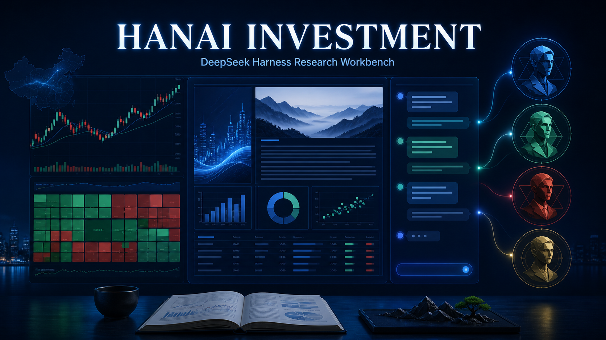
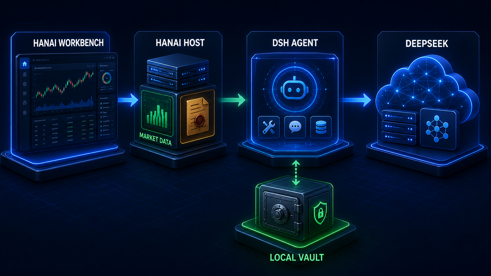
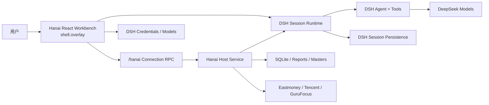

# Hanai Investment for DSH

> 以 DeepSeek Harness 为 Agent 内核的本地优先 A 股研究工作台。

[](https://github.com/deepseek-ai/deepseek-harness)
[](package.json)
[](packages)
[](LICENSE)

Hanai Investment 把行情、自选、个股与估值研究、四位大师研判、不可变报告和报告后的持续对话，组合在一个完整的 React 工作台中。DeepSeek Harness（DSH）负责模型、Agent、工具、Session、流式事件和会话持久化；Hanai 负责投资业务、研究资料、报告版本和全部产品界面。



## 核心体验

- 市场全景：六大指数、市场宽度、涨跌榜、成交/换手榜、行业与概念热力、板块成分。
- 自选观察：多分组、移动与删除、加入成本和区间表现、周期行情刷新、来源与过期状态。
- 个股研究：分时、日/周/月 K 线、交易和基本面指标、GuruFocus 估值摘要与数据出处。
- 四位大师：段永平、查理·芒格、沃伦·巴菲特、混江龙；每位大师都有独立 Skill 与参考资料快照。
- 大师研判：每次研判创建独立工作区与持久 DSH Session，报告通过校验后原子封存并记录 SHA-256。
- 报告后续聊：报告完成不归档 Session；Hanai 自绘聊天继续连接同一位大师，支持历史、流式输出、工具树、队列、steer、取消、审批和问题响应。
- 显式修订：普通追问不会覆盖报告；只有“创建修订版”才生成 v2、v3 等新的不可变快照。
- DeepSeek 设置：页面可写入或移除 Key、查看模型目录；Key 由 DSH Credentials 托管，不进入 Hanai 数据库。
- 两套主题：澄海蓝与青玉绿，均限定在 Workbench 根节点，不污染 DSH 全局样式。
- 完全自有界面：使用 React 18、DSH Slot/Runtime 和 CSS Modules；不显示或复用 DSH 原生聊天 UI。

## 架构





关键边界：

- DSH 是聊天与 Agent 的唯一事实源；Hanai 不建立第二套 `messages` 或 `turns` 表。
- Hanai SQLite 只保存自选、证券主数据、研判索引、报告版本和 opaque `dshSessionId`。
- 报告是 Hanai 封存的业务快照；工作区 `REPORT.md` 只是 Agent 可写的生成副本。
- 浏览器不接触文件系统或 SQLite；全部业务写入经由同源 `/hanai` RPC。

更完整的设计见 [总体架构](docs/architecture.md) 与 [ADR 索引](docs/README.md)。

## 运行要求

- Node.js `^22.19.0` 或 `>=24.0.0`
- pnpm `11.7.0`
- DeepSeek Harness `0.1.0-rc.5` 至 `<0.2.0`；推荐 CLI、Web App 与 Hanai 使用同一 rc 版本
- 一个 DeepSeek API Key（只在实际运行 Agent 时需要）

DSH 仍处于 pre-release，rc 之间不承诺兼容。仓库把 Host、Client 和 profile 装配都纳入兼容性检查，但升级前仍应运行完整门禁。

## 从源码安装

```bash
git clone git@github.com:hancao97/hanai-investment-dsh.git
cd hanai-investment-dsh
pnpm install
pnpm run build
pnpm run profile:install -- --package .
pnpm run profile:verify
dsh --profile hanai-investment
```

安装器会创建独立 `hanai-investment` Profile，先加入与当前 DSH CLI 同版本的 Web App，再加入 Hanai Bundle。它会拒绝修改 `web`、`headless` 等保留 Profile，也会在目标 Profile 含无关依赖时停止。

通用 DSH Web 仍按原方式启动：

```bash
dsh web
```

两者可以使用不同端口同时运行。详见 [ADR-0003](docs/adr/0003-isolated-dsh-profile.md)。

### 手工安装发布包

发布到 npm 后，也可以显式完成同样的两层装配：

```bash
dsh plugin --profile hanai-investment add --workspace-root @deepseek-ai/dsh-web-app@0.1.0-rc.6
dsh plugin --profile hanai-investment add --workspace-root hanai-investment-dsh
dsh --profile hanai-investment
```

请把示例中的 rc 版本替换为 `dsh --version` 输出的精确版本。

## 数据与隐私

Hanai 业务数据默认写入：

```text
~/.hanai-investment-dsh/
├── db/hanai.sqlite
├── cache/
├── judgements/<id>/workspace/
└── judgements/<id>/reports/<version>/
```

新版不会检测、读取、导入、修改或删除旧版数据目录。首次启动会建立一套空数据库，自选和研判需要重新创建。

以下内容仍由当前 `$DSH_HOME` 管理：

- DeepSeek Key 与模型设置；
- Session 事件、消息、工具历史；
- 聊天附件和 Profile 安装状态。

Hanai 数据根默认权限为 `0700`，普通数据文件为 `0600`。API Key 是 write-only secret：页面提交后清空输入，RPC 不返回明文，日志和报告也不得包含它。

## 行情与来源语义

数据源必须把“真实值”和“可用性”一起交给 UI：

- 东方财富实时集群可用时标记 fresh；
- Node TLS 环境被实时集群拒绝时，非历史行情降级到东方财富延迟源；
- 分时和 K 线在必要时降级到腾讯行情；
- 最近成功快照标记 stale，完全不可用则显示 unavailable；
- 缺失值始终显示为 `—`，绝不解释成 `0`；
- 页面不合成不存在的指数走势，也不把延迟或缓存数据标成 LIVE。

GuruFocus 接口仅作为个人研究原型使用，遵循页面声明的来源、缓存时间与再分发限制。生产或商业部署应替换为有正式授权和 SLA 的数据供应商。

## 开发与验证

```bash
pnpm run typecheck
pnpm run test
pnpm run build
pnpm run pack:check
```

一键执行全部门禁：

```bash
pnpm run check
```

门禁覆盖：

- Provider 解析、降级、缓存和证券同步；
- SQLite migration、事务、权限和数据隔离；
- 报告校验、修复、原子封存、哈希与版本；
- DSH Session 报告/普通聊天生命周期；
- 自绘聊天的格式化、pending、queue 和交互；
- DSH Client ModuleLoader 单文件协议；
- npm allowlist、入口、source map、大师资产与旧数据路径硬隔离。

真实装配验证使用临时 `DSH_HOME` 安装 `hanai-investment` Profile，再以随机 loopback 端口启动 Host/Web；不会触碰用户的官方 `web` Profile。

## 目录结构

```text
packages/
├── contracts/          JSON-safe Host/Client 合约
├── domain/             SQLite、报告、行情、估值、证券与自选领域逻辑
├── host/               Cordis Host、/hanai RPC、DSH Session 编排
├── client-workbench/   全屏 React 产品工作台
├── client-chat/        Hanai 自绘 DSH Session 对话
└── masters/            四位大师的 Skill 与参考资料
tooling/
└── dsh-client-bundle/  树外 DSH Client closure 构建适配器
scripts/                profile 安装/校验与发布门禁
docs/                   架构与 ADR
```

## 当前边界

- `shell.overlay` 是 DSH AppFrame 的全屏插件画布，不是弹窗、iframe 或命令行 Shell。它让 Hanai 在不 fork DSH 的前提下拥有完整页面；当前没有 URL deep-link。
- DSH 尚未发布稳定的树外 Client Plugin 构建 SDK，因此仓库维护了一个最小、版本锁定的 bundler adapter。
- DSH Session 删除与跨版本迁移能力仍有限；备份持续对话时，需要同时保留 Hanai 数据根和 DSH Session 数据。
- 本项目是研究辅助工具，不构成投资建议，不承诺数据实时性、完整性或投资收益。

## License

[MIT](LICENSE)
