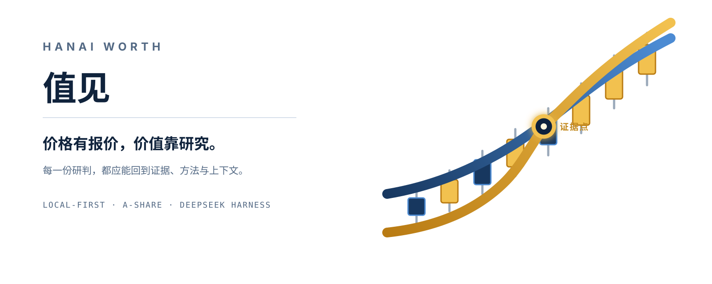
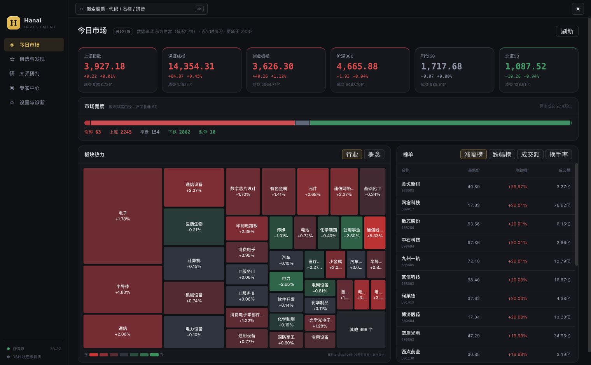
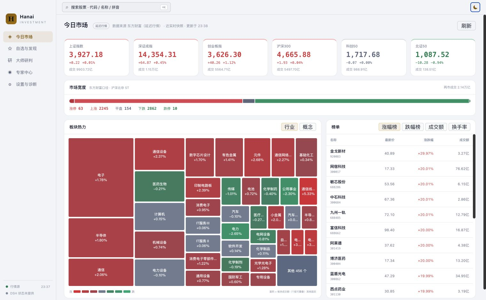
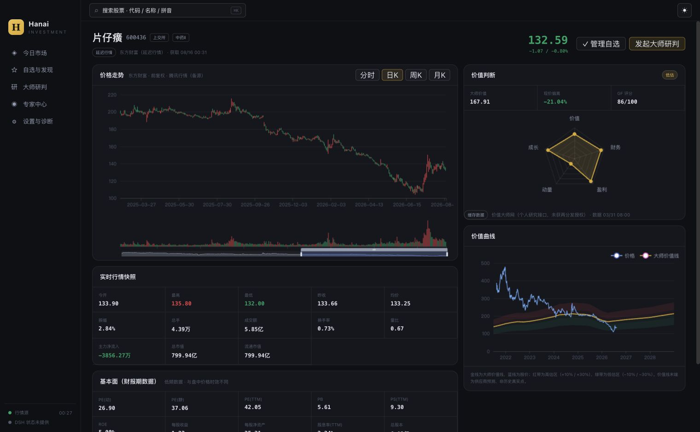
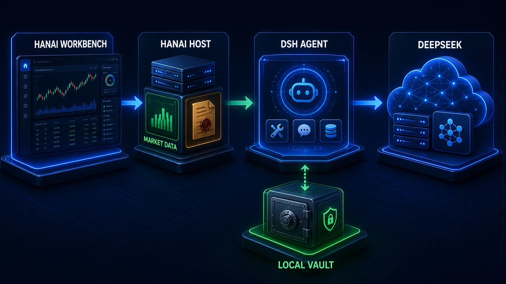
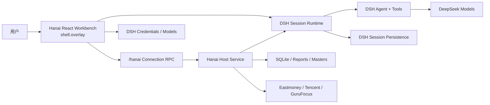

# Hanai Worth · 值见

> 价格有报价，价值靠研究。



[](https://github.com/deepseek-ai/deepseek-harness)
[](package.json)
[](packages)
[](LICENSE)

**Hanai Worth · 值见** 是以 DeepSeek Harness 为 Agent 内核的本地优先 A 股研究工作台。它把市场全景、自选估值、个股行情与 K 线观察、大师方法论研判、报告归档和持续追问放进一条完整研究链路，帮助用户从“发现一家公司”走到“形成并持续验证自己的判断”。

DeepSeek Harness（DSH）负责模型、Agent、工具、Session、流式事件和会话持久化；Hanai Worth 负责证券与估值数据、自选分组、研究资料、不可变报告快照和全部产品界面。产品保留“今日市场、自选与发现、大师研判、专家中心、设置与诊断”五个一级页面，以及个股和研判详情页。

品牌中的两条趋势线在证据点形成金叉：价格给出市场报价，研究帮助看见价值。每一份研判，都应能回到证据、方法与上下文。

## 界面预览

黑夜模式保留原客户端的信息密度、页面位置与 A 股涨红跌绿语义；市场热力图由 ECharts `treemap` 绘制，面积对应板块成交额。



亮色模式只替换语义色彩 token，侧栏、顶栏、卡片、表格和图表的位置与尺寸保持不变。



个股详情以行情与价值并排呈现：左侧是分时/日/周/月 K 线、行情快照和基本面，右侧是价值判断与独立价值曲线；金线是供应商大师价值序列，蓝线是股价，红/绿带分别表示高估与低估区间。



## 从行情到研判的完整链路

1. **看市场**：六大指数、市场宽度、行业/概念热力图和涨幅、跌幅、成交额、换手率榜单共同呈现当日结构。
2. **建自选**：搜索股票，按分组添加、移动和维护标的；刷新当前分组并比较行情、估值与加入以来表现。
3. **读个股**：结合前复权 K 线、均线、量价观察标记、行情快照、基本面、合理估值和价值曲线建立上下文。
4. **发起研判**：选择一位大师，由 Agent 独立检索和核验公开资料，形成可归档的完整 Markdown 报告。
5. **继续验证**：在原 DSH Session 中追问、查看工具过程或显式修订报告；已完成或失败的研判可确认后删除。

## 产品能力

### 今日市场与自选

- **市场全景**：六大指数、涨跌停与上涨/下跌家数、两市成交额、行业/概念 `treemap` 和四类榜单并行加载；热力图面积代表成交额，颜色遵循 A 股涨红跌绿。
- **自选分组**：默认分组始终保留，支持新建、重命名、删除自定义分组，以及股票添加、移动、移除和三态排序。
- **自选行情**：展示最新价、涨跌幅、成交额、换手率、市值、PE、PB、加入日期和加入以来表现；行情状态明确区分 fresh、stale 与 unavailable。
- **自选估值**：合理估值由价值大师网按分组异步、限并发加载，不阻塞行情表格；同时展示距现价的金额和比例。合理估值高于现价的上行空间使用红色，低于现价使用绿色。
- **加载与刷新**：支持手动刷新当前分组；行情与估值分别展示加载、失败和无数据状态，单只股票估值失败不会拖垮整组。

### 个股行情、估值与 K 线观察

- **行情与财务快照**：展示最新报价、开高低收、成交量/额、换手率、量比、主力净流入、市值，以及 PE、PB、ROE、EPS、营收、利润率和资产负债率等字段。
- **多周期行情**：支持分时、日 K、周 K、月 K；K 线统一使用前复权。日 K 首屏按需加载，向左拖动可继续取得更早数据；周 K、月 K 直接提供完整历史。
- **双均线模式**：可在短线 `MA5 / MA10` 与中线 `MA20 / MA60` 间切换，均线始终按当前日、周或月 K 周期的收盘价计算。
- **量价观察标记**：日、周、月 K 使用同一套已收盘规则标记“巨量分歧、巨量弱收、深跌放量、深跌强收、深跌长影、放量回稳”；同周期多标记可堆叠，悬浮时在一个 tooltip 中查看行情、均线和触发说明。
- **价值判断**：合理估值加载中使用独立骨架与动画，无数据时才显示占位；估值摘要、五维雷达与价格/大师价值曲线彼此独立，不因估值源失败阻断行情。
- **来源可追溯**：图表和卡片保留来源、获取时间、延迟/缓存状态；缺失字段显示 `—` 或隐藏，不把空值解释为 `0`。

量价标记是根据历史条件频率筛选出的**收盘后观察提示**，不等同于买点、卖点或收益承诺。日 K、周 K、月 K tooltip 都会给出各自独立样本中未来观察窗口的上涨/走弱频率、样本数和截止日；小样本会明确提示方向不稳定，不会把日线数字外推到其它周期。触发定义见[量价观察标记产品决策](docs/kline-turning-marker-product-decision-2026-08-22.md)，周期统计见[日 / 周 / 月独立后续方向研究](docs/kline-period-turning-study-2026-08-22.md)，完整研究索引见[设计文档](docs/README.md)。

### 大师研判与持续对话

- **单专家独立研判**：支持段永平、查理·芒格、沃伦·巴菲特和混江龙四套方法论；每次研判绑定独立工作区和持久 DSH Session。
- **可核验报告**：保留 preparing → running → verifying → completed/failed 状态、实时执行过程、失败原因、归档信息、不可变报告版本、哈希与文件大小。
- **报告默认、对话延续**：完成后默认打开研判报告，也可切换到“继续对话”，沿用原 `dshSessionId` 追问；普通追问不会静默创建新报告版本。
- **Markdown 与过程展示**：报告和对话正确渲染标题、列表、表格、引用、链接、行内代码和代码块；思考与工具活动按轮次紧凑折叠，详细参数和结果按需展开。
- **运行中交互**：支持排队发送、立即插话、编辑/移除队列消息、取消运行，以及工具批准和结构化问题回复。
- **安全删除**：仅已完成或失败且会话不在运行的研判允许删除；二次确认后移除全部本地报告/工作文件并归档对应 DSH Session，进行中的研判受到保护。

### 工作台与运行管理

- **统一交互系统**：按钮、输入框、选择器、焦点、禁用和危险操作使用一致的语义色与明暗主题 token，并保留 A 股红涨绿跌业务色。
- **亮色/黑夜模式**：两套主题只替换语义色彩，不改变页面结构、图表数据或业务含义。
- **全局搜索与深链接**：可按代码、名称或拼音搜索股票；`#/dashboard`、`#/watch`、`#/judgements`、`#/personas`、`#/settings` 及详情页支持刷新、前进、后退和直接打开。
- **设置与诊断**：在工作台内管理 DSH Credentials、默认模型和主题，查看 Agent、数据源、缓存、本地存储与版本状态，并可打开数据目录或清理行情/估值缓存。
- **完全自有界面**：使用 React 18、DSH Slot/Runtime、ECharts 和 CSS Modules；不显示或复用 DSH 原生聊天 UI。

## 架构





关键边界：

- DSH 是聊天与 Agent 的唯一事实源；Hanai 不建立第二套 `messages` 或 `turns` 表。
- Hanai SQLite 只保存自选、证券主数据、研判索引、报告版本和 opaque `dshSessionId`。
- 报告是 Hanai 封存的业务快照；工作区 `REPORT.md` 只是 Agent 可写的生成副本。
- 浏览器不接触文件系统或 SQLite；全部业务写入经由同源 `/hanai` RPC。

更完整的设计见 [总体架构](docs/architecture.md) 与 [ADR 索引](docs/README.md)。

## 运行要求

- Node.js `^22.19.0` 或 `>=24.0.0`
- pnpm `11.7.0`
- DeepSeek Harness `0.1.1-rc.2`；DSH 仍处于 pre-release，升级到其它 rc 前必须重新验证，CLI、Web App 与 Hanai 应使用同一版本
- 一个 DeepSeek API Key（只在实际运行 Agent 时需要）

DSH 仍处于 pre-release，rc 之间不承诺兼容。仓库把 Host、Client 和 profile 装配都纳入兼容性检查，但升级前仍应运行完整门禁。

## 从源码安装

```bash
git clone git@github.com:hanai-labs/worth-dsh.git
cd worth-dsh
pnpm install
pnpm run build
pnpm run profile:install -- --package .
pnpm run profile:verify
dsh --profile hanai-investment
```

安装器会创建或安全迁移独立的 `hanai-investment` Profile。最终 Bundle 顺序固定为 DSH Base、DSH Web App、Hanai；只有 `hanai-investment-dsh` 是 Profile dependency。Base 与 Web App 必须由当前 DSH CLI 的 installation fallback 提供，不能再用 `dsh plugin add @deepseek-ai/dsh-web-app` 安装到 Profile，否则相同版本的 DSH runtime 仍可能被加载成两个模块实例。安装器会拒绝修改 `web`、`headless` 等保留 Profile，也会在目标 Profile 含无关依赖或 Bundle 时停止。

通用 DSH Web 仍按原方式启动：

```bash
dsh web
```

两者可以使用不同端口同时运行。详见 [ADR-0003](docs/adr/0003-isolated-dsh-profile.md)。

### 安装发布包或修复旧 Profile

在包含本仓库安装脚本的发布目录中，把 `--package` 换成 npm 包名即可。重复执行是安全的，也会迁移早期错误安装过 Web App dependency 的 Profile：

```bash
pnpm run build
pnpm run profile:install -- --package hanai-investment-dsh
pnpm run profile:verify
dsh --profile hanai-investment
```

迁移前请先停止正在运行的 `dsh --profile hanai-investment` 进程。不要手工执行 `dsh plugin ... add @deepseek-ai/dsh-web-app`；它会重新引入 Profile-local DSH runtime shadow。

## 数据与隐私

Hanai 业务数据默认写入：

```text
~/.hanai-investment-dsh/
├── db/hanai.sqlite
├── cache/
├── judgements/<id>/workspace/
└── judgements/<id>/reports/<version>/
```

新版不会检测、读取、导入、修改或删除旧版数据目录。首次启动会建立一套空数据库，自选和研判需要重新创建。

以下内容仍由当前 `$DSH_HOME` 管理：

- DeepSeek Key 与模型设置；
- Session 事件、消息、工具历史；
- 聊天附件和 Profile 安装状态。

Hanai 数据根默认权限为 `0700`，普通数据文件为 `0600`。API Key 是 write-only secret：页面提交后清空输入，RPC 不返回明文，日志和报告也不得包含它。

## 行情与来源语义

数据源必须把“真实值”和“可用性”一起交给 UI：

- 东方财富实时集群可用时标记 fresh；
- Node TLS 环境被实时集群拒绝时，非历史行情降级到东方财富延迟源；
- 分时和前复权 K 线在必要时降级到腾讯行情；日 K 支持向左拖动分段补齐历史，周/月 K 返回完整历史；
- 自选行情先返回，价值大师网合理估值再按组异步补齐并按日缓存；两条链路互不阻塞；
- 估值加载中、供应商无数据和请求失败是三种不同 UI 状态；合理估值或成交额缺失时不渲染虚假值；
- 最近成功快照标记 stale，完全不可用则显示 unavailable；
- 缺失值始终显示为 `—`，绝不解释成 `0`；
- 页面不合成不存在的指数走势，也不把延迟或缓存数据标成 LIVE。

GuruFocus 接口仅作为个人研究原型使用，遵循页面声明的来源、缓存时间与再分发限制。生产或商业部署应替换为有正式授权和 SLA 的数据供应商。

## 开发与验证

```bash
pnpm run typecheck
pnpm run test
pnpm run build
pnpm run pack:check
```

一键执行全部门禁：

```bash
pnpm run check
```

门禁覆盖：

- Provider 解析、降级、缓存和证券同步；
- SQLite migration、事务、权限和数据隔离；
- 报告校验、修复、原子封存、哈希与版本；
- 研判删除约束、Session 归档与本地文件清理；
- DSH Session 报告/普通聊天生命周期；
- 自绘聊天的 Markdown、紧凑过程、pending、queue/steer 和交互；
- 前复权历史加载、MA5/10 与 MA20/60、量价观察标记及 tooltip；
- 自选合理估值的异步批量加载、缓存、失败隔离和距现价计算；
- DSH Client ModuleLoader 单文件协议；
- npm allowlist、入口、source map、大师资产与旧数据路径硬隔离。

真实装配验证使用临时 `DSH_HOME` 安装 `hanai-investment` Profile，再以随机 loopback 端口启动 Host/Web；不会触碰用户的官方 `web` Profile。

完整的已验证启动步骤、首次设置、浏览器矩阵和故障排查见 [启动与验收报告](docs/startup-and-verification.md)。逐页功能与布局约束见 [客户端迁移与验收基线](docs/client-parity.md)。

## 目录结构

```text
packages/
├── contracts/          JSON-safe Host/Client 合约
├── domain/             SQLite、报告、行情、估值、证券与自选领域逻辑
├── host/               Cordis Host、/hanai RPC、DSH Session 编排
├── client-workbench/   全屏 React 产品工作台
├── client-chat/        Hanai 自绘 DSH Session 对话
└── masters/            四位大师的 Skill 与参考资料
tooling/
└── dsh-client-bundle/  树外 DSH Client closure 构建适配器
scripts/
├── research/           可复现的量价与 K 线条件研究脚本
└── ...                 profile 安装、校验与发布门禁
docs/
├── research-data/      冻结口径、样本清单与可复现研究结果
└── ...                 架构、ADR、产品决策与验收文档
```

## 当前边界

- `shell.overlay` 是 DSH AppFrame 的全屏插件画布，不是弹窗、iframe 或命令行 Shell。它让 Hanai 在不 fork DSH 的前提下拥有完整页面；Workbench 通过 `location.hash` 提供页面深链接，不要求 DSH 增加通用 Router Slot。
- DSH 尚未发布稳定的树外 Client Plugin 构建 SDK，因此仓库维护了一个最小、版本锁定的 bundler adapter。
- DSH Session 删除与跨版本迁移能力仍有限；备份持续对话时，需要同时保留 Hanai 数据根和 DSH Session 数据。
- 本项目是研究辅助工具，不构成投资建议，不承诺数据实时性、完整性或投资收益。

## License

[MIT](LICENSE)

客户端 bundle 内联依赖的许可证与声明见 [THIRD_PARTY_NOTICES.md](THIRD_PARTY_NOTICES.md)。
