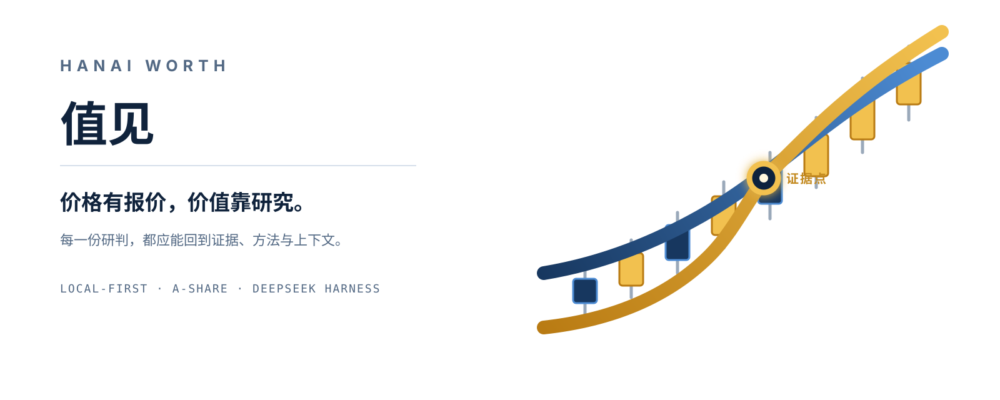
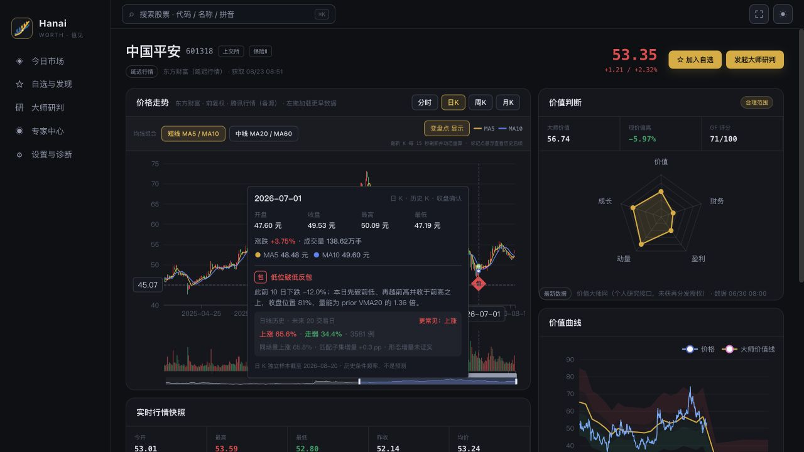
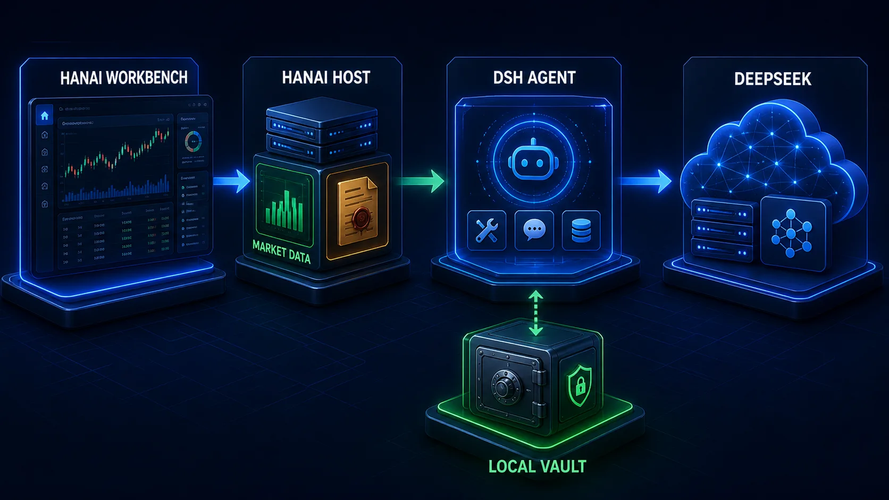
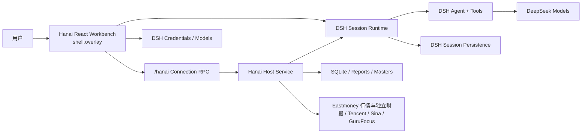

# Hanai Worth · 值见

> 价格有报价，价值靠研究。



[](https://github.com/deepseek-ai/deepseek-harness)
[](package.json)
[](packages)
[](LICENSE)

**Hanai Worth · 值见** 是以 DeepSeek Harness 为 Agent 内核的本地优先 A 股研究工作台。它把市场全景、自选估值、个股行情与 K 线观察、大师方法论研判、专家开放对谈、报告归档和持续追问放进一条完整研究链路，帮助用户从“发现一家公司”走到“形成并持续验证自己的判断”。

DeepSeek Harness（DSH）负责模型、Agent、工具、Session、流式事件和会话持久化；Hanai Worth 负责证券与估值数据、自选分组、研究资料、不可变报告快照和全部产品界面。产品包含“今日市场、自选与发现、大师研判、专家对谈、专家中心、设置与诊断”六个一级页面，以及个股、研判和对谈详情页。

插件包名为 `hanai-investment-dsh`，独立 DSH Profile 名为 `hanai-investment`；安装和启动命令使用这两个名称。当前已验证的 DSH 版本为 `0.2.0-rc.2`。

品牌中的两条趋势线在证据点形成金叉：价格给出市场报价，研究帮助看见价值。每一份研判，都应能回到证据、方法与上下文。

## 在线投研报告

| 报告 | 在线页面 | 仓库内自包含 HTML | 内容 |
| --- | --- | --- | --- |
| 变盘点能力审计 | [GitHub Pages 首页](https://hancao97.github.io/hanai-investment-dsh/) | [turning-point-capability-audit-2026-08-23.html](docs/turning-point-capability-audit-2026-08-23.html) | 当前 10 类生产标记、22 个有效周期格、matched 增量、候选与缠论生命周期 |
| A 股未来一年周期展望 | [完整门禁版在线报告](https://hancao97.github.io/hanai-investment-dsh/a-share-cycle-outlook.html) | [a-share-cycle-outlook-2026-08-25.html](docs/a-share-cycle-outlook-2026-08-25.html) | 点时市场截面、主题A—C证据评分、六股质量/估值/相对强弱、条件历史比例、六门结果与Round 4全状态复核 |

周期展望实际调用仓库内五个专家 Skill，但它们是同源的 **AI 方法论角色**。完成版先冻结2026-08-25市场解析快照与官方财报，补齐事实、机制、质量、估值和反证五门，再由 Round 4 的独立 `council_vote` 关闭会商门；[专家实际读取的前置输入](docs/research-data/a-share-cycle-outlook-pre-council-2026-08-25.json)与五份[原始输出、提示词及 Skill 哈希](docs/research-data/a-share-cycle-expert-runs-2026-08-25.json)分别保存并以 SHA 绑定。主题映射核对和股票门禁核对不是独立投票，具体模型与reasoning配置也未在产物中冻结；报告不提供未经校准的概率、目标价或收益承诺。

## 界面预览

黑夜模式保留原客户端的信息密度、页面位置与 A 股涨红跌绿语义；市场热力图由 ECharts `treemap` 绘制，面积对应板块成交额。


亮色模式只替换语义色彩 token，侧栏、顶栏、卡片、表格和图表的位置与尺寸保持不变。


个股详情以行情与价值并排呈现：左侧是分时/日/周/月 K 线、行情快照和基本面，右侧是价值判断与独立价值曲线；金线是供应商大师价值序列，蓝线是股价，红/绿带分别表示高估与低估区间。


变盘点把可复算的量价条件直接标在日/周/月 K 线上。下图是实际运行界面：中国平安在 2026-07-01 命中 `低位破低反包`，悬浮卡同时展示触发条件、20 日历史方向频率、样本数、同场景对照和研究截止日；工具栏可以一键显示或隐藏全部变盘点。



> 截图中的百分比是截至 2026-08-20 的历史条件频率，不是对中国平安下一次走势的预测，也不构成投资建议。

## 从行情到研究的完整链路

1. **看市场**：六大指数、市场宽度、行业/概念热力图和涨幅、跌幅、成交额、换手率榜单共同呈现当日结构。
2. **建自选**：搜索股票，按分组添加、移动和维护标的；刷新当前分组并比较行情、估值与加入以来表现。
3. **读个股**：结合前复权 K 线、均线、量价观察标记、行情快照、基本面、合理估值和价值曲线建立上下文。
4. **开放对谈**：不选股票直接选择一位专家，围绕行业周期、商业模式、近期事件或决策问题持续讨论。
5. **发起研判**：选择股票和一位大师，由 Agent 独立检索和核验公开资料，形成可归档的完整 Markdown 报告。
6. **继续验证**：开放对谈和研判追问都复用各自原有的 DSH Session；研判还可查看工具过程或显式修订报告。

## 产品能力

### 今日市场与自选

- **市场全景**：六大指数、涨跌停与上涨/下跌家数、两市成交额、行业/概念 `treemap` 和四类榜单并行加载；热力图面积代表成交额，颜色遵循 A 股涨红跌绿。
- **自选分组**：默认分组始终保留，支持新建、重命名、删除自定义分组，以及股票添加、移动、移除和三态排序。
- **自选行情**：展示最新价、涨跌幅、成交额、换手率、市值、PE、PB、加入日期和加入以来表现；行情状态明确区分 fresh、stale 与 unavailable。
- **自选估值**：合理估值由价值大师网按分组异步、限并发加载，不阻塞行情表格；同时展示距现价的金额和比例。合理估值高于现价的上行空间使用红色，低于现价使用绿色。
- **加载与刷新**：支持手动刷新当前分组；行情与估值分别展示加载、失败和无数据状态，单只股票估值失败不会拖垮整组。

### 个股行情、估值与 K 线观察

- **行情与财务快照**：展示最新报价、开高低收、成交量/额、换手率、量比、主力净流入、市值，以及 PE、PB、ROE、EPS、营收、利润率和资产负债率等字段。
- **多周期行情**：支持分时、日 K、周 K、月 K；K 线统一使用前复权。日 K 首屏按需加载，向左拖动可继续取得更早数据；周 K、月 K 直接提供完整历史。当前正在查看的日/周/月 K 每 15 秒刷新，同日期覆盖、新周期追加，切换回已加载周期时立即刷新一次。
- **双均线模式**：可在短线 `MA5 / MA10` 与中线 `MA20 / MA60` 间切换，均线始终按当前日、周或月 K 周期的收盘价计算。
- **变盘点标记**：日、周、月 K 保留“巨量分歧、巨量弱收、深跌放量、深跌强收、深跌长影、放量回稳”；日 K 另外显示“低位破低反包、金针探底观察、金针突破确认、高位巨量长上影”。同周期多标记可堆叠，悬浮时在一个 tooltip 中查看行情、均线、实际触发条件与历史证据。
- **动态重算与开关**：只有最新 K 的 OHLCV/成交额发生变化时才替换数据并重算当前图表；最新一根显示“动态计算”，其标记可能在周期结束前变化，历史 K 才显示“收盘确认”。“变盘点”开关默认开启，关闭后只隐藏标记和证据，不停止行情刷新，也不影响 K 线、成交量或均线。
- **价值判断**：合理估值加载中使用独立骨架与动画，无数据时才显示占位；估值摘要、五维雷达与价格/大师价值曲线彼此独立，不因估值源失败阻断行情。
- **来源可追溯**：图表和卡片保留来源、获取时间、延迟/缓存状态；缺失字段显示 `—` 或隐藏，不把空值解释为 `0`。

变盘点是根据历史条件频率筛选出的**量价观察提示**，不等同于买点、卖点或收益承诺。原有六类在日 K、周 K、月 K 展示各周期独立证据；全市场新增的 `低位破低反包`、金针观察/确认和 `高位巨量长上影`只有日线证据，因此不外推到周/月 K。

> **完整变盘点能力审计**：查看 [GitHub Pages 在线报告](https://hancao97.github.io/hanai-investment-dsh/turning-point-capability-audit-2026-08-23.html) 或 [仓库内自包含 HTML](docs/turning-point-capability-audit-2026-08-23.html)。报告逐一对账当前 10 类生产标记、22 个有效周期格、16 个冻结候选、matched 增量、置信区间及拟影子验证方向。

### 变盘点如何计算

线上触发不调用大模型，也不读取新闻、基本面或未来数据，而是对当前股票已经取得的前复权 OHLCV 做确定性计算；相同 K 线输入必然得到相同标记。加载不足 121 根当前周期 K 时不显示，以保证均线、回撤和波动率充分预热。

| 计算项 | 口径 |
| --- | --- |
| 趋势 | `MA5 / MA10 / MA20 / MA60`、此前 10/20 周期收益、距此前 60 周期高点回撤 |
| 量能 | `Volume / VMA20`；新增日线 V0 使用不包含当天的 `VMA20⁻`，避免当天巨量抬高自己的基准 |
| 波动 | `TR` 与不包含当天的 `ATR20⁻` |
| K 线位置 | `CLV=(Close-Low)/(High-Low)`、实体、上影、下影占当期振幅比例 |
| 结构 | 前高/前低、20/60 周期高低点、位于各自 MA20 下方的周期数 |
| 确认 | 原始形态标在锚点日；需要确认的形态只标在真实确认日，不把未来确认回填到过去 |
| 去重 | 同股同类按预定观察窗口冷却，避免连续多根相近 K 线重复报点 |

产品中的十类标记分为三种语义：

| 产品语义 | 标记 | 周期 | 解释 |
| --- | --- | --- | --- |
| 量价观察 | `分 / 弱 / 深 / 强 / 影 / 稳` | 日、周、月 | 描述上涨后巨量分歧，或深跌区放量、强收、长影与回稳 |
| 低位观察/确认 | `包 / 针 / 确` | 仅日 K | `包`是破前低后反包前高；`针`只是金针锚点；`确`只在未来 1～3 日真的突破锚点高点与 MA5 时出现 |
| 风险观察 | `拒` | 仅日 K | 上涨结构中创新高、巨量、长上影和弱收盘；提示换手受阻，不代表机械卖出 |

精确阈值、显示冷却与 tooltip 口径见[变盘点产品决策](docs/kline-turning-marker-product-decision-2026-08-22.md)。

### 全市场回测与验证

`FULL_A_TURNING_V0` 研究冻结了 16 个原始/确认规则，先定规则和主观察窗口，再统计结果，避免看到漂亮数字后临时改参数。研究请求 5,813 只当前及历史 A 股证券，成功取得 5,809 只行情；其中 5,704 只达到至少 120 根预热要求，共分析 9,813,872 根有效可交易日 K，集合日期范围为 2014-01-02 至 2026-08-20。公开行情来自新浪、腾讯和东方财富的复权日线；北交所退市历史、逐日 ST 状态和完整退市收益仍不完备，因此这里称“实质性全市场扩展”，不称无偏的全历史 A 股。

统一回测时钟与交易约束：

- 信号只使用 `t` 收盘时已知的 OHLCV，滚动量、ATR、前高和前低使用 `t` 之前的数据；
- 最早执行价为信号后下一根可交易 K 的开盘，`H 日`在 `signal + H` 收盘结算；零成交/停牌行不作为可交易 K；
- 买侧正收益频率扣除约 `0.312%` 固定往返摩擦；风险侧只统计未来原始股价下跌频率，不伪装成可做空收益；
- 信号日前 20 根成交额中位数至少 3,000 万元，5,000 万元作为预先声明的流动性敏感性；
- 每只股票每个信号阶段按主窗口去重，年度和时代分段要求退出日也留在分段内，未成熟事件直接删除而不是尾部强平。

下表是扩展未见股票的主窗口结果；“方向频率”是回顾性的条件比例，俗称“胜率”但不是下一次概率。买侧平均收益已扣除固定摩擦，风险侧平均方向收益表示平均下跌幅度。

| 冻结形态 | 主窗口与方向 | 样本 | 历史方向频率 | 平均方向收益 | 同场景对照 | 产品结论 |
| --- | --- | ---: | ---: | ---: | ---: | --- |
| 低位破低反包 | 20 日上涨 | 3,581 | **65.60%** | **+7.12%** | 65.75% | 显示 `包`；形态独立增量未证实 |
| 深跌巨量强收 | 20 日上涨 | 1,770 | **64.18%** | **+9.68%** | 66.21% | 保留相邻旧观察；巨量增量未证实 |
| 金针探底观察 | 20 日上涨 | 18,937 | 50.85% | +1.74% | 50.34% | 显示蓝色研究锚点，不称买点 |
| 金针突破确认 | 20 日上涨 | 10,650 | 51.81% | +1.53% | 50.80% | 确认未提升为高胜率，只显示 `确` |
| 高位巨量长上影 | 5 日下跌 | 5,721 | 56.58% | +0.15% | 55.46% | 显示 `拒`风险观察，不称卖点 |
| 巨量后缩量不破转强 | 20 日上涨 | 75 | 50.67% | +2.07% | 51.75% | 样本过少，不进入默认标记 |
| 极缩量后脱离平台 | 20 日上涨 | 22,495 | 47.68% | +0.84% | 49.53% | 明确否决为买点 |

验证设计不仅看原始方向频率：

1. 旧研究涉及的 249 只股票整体放入 `prior_studied`，不参与扩展未见股票主结果；其余股票按代码 SHA-256 固定拆分为开发 50%、验证 30%、测试 20%。
2. 每个事件匹配同一交易日、同方向、同板块、相近前置涨跌幅和流动性层的普通股票，判断形态是否优于当时共同市场环境。
3. 方向与收益使用“股票 + 信号月份”双向聚类区间；16 个主假设的匹配方向增量使用 Holm 5% 家族错误率校正。
4. 额外检查时代/年度、主板/创业板/科创板/北交所、3,000万/5,000万元流动性、去掉最佳 5% 事件和更高摩擦后的稳定性。
5. 严格上线门槛还要求非重叠样本至少 200、原始方向率至少 60%、聚类区间下界高于 50%、匹配方向及收益增量区间下界均高于 0、跨年度和验证/测试股票折稳定。本轮通过数为 **0/16**，因此产品没有新增任何“已验证高胜率买点”。

截至 2026-08-20 的数据已经参与规则研究，只能作为回顾性证据。从 2026-08-21 起应按冻结 V0 规则持续记录前瞻影子事件，积累足够样本后再做一次不改参数的检验。完整覆盖、分层、聚类区间、匹配对照、否证结果和已知偏差见[全市场 A 股日 K 变盘点研究](docs/full-market-turning-point-study-2026-08-22.md)，机器可读结果见[冻结 JSON](docs/research-data/full-market-turning-point-study-2026-08-22.json)，复现脚本见[full-market-turning-point-study.py](scripts/research/full-market-turning-point-study.py)。完整研究索引见[设计文档](docs/README.md)。

### 专家开放对谈

- **不必先选股票**：可直接讨论行业周期、商业模式、市场情绪、决策困境或近期事件，不生成 `REPORT.md`。
- **持久开放会话**：每次对谈绑定独立专家快照与 DSH Session，支持正常追问、检索、工具调用、队列、steer、取消、审批和历史恢复。
- **专用对谈工作台**：左侧保留对谈历史，右侧消息区占满剩余高度；支持深链接和刷新恢复，思考与工具过程默认折叠，输入区固定在当前会话底部。
- **六位对谈专家**：段永平、混江龙、查理·芒格、沃伦·巴菲特、散户乙均支持研判与开放对谈；孙宇晨视角仅进入开放对谈。
- **散户乙视角**：按 nuwa 的本地语料流程，从《从冲浪到潜水》发言汇编提炼股权思维、可持续 ROE、分红复利和底线回报；保留 PDF 页码、观点演化和汇编归属边界。详见[能力包](packages/masters/assets/sanhu-yi-perspective/SKILL.md)与[蒸馏记录](packages/masters/assets/sanhu-yi-perspective/references/provenance.md)。
- **孙宇晨视角边界**：参考用户指定的[开源能力包](https://github.com/alchaincyf/nuwa-skill/tree/main/examples/sun-yuchen-perspective)，用于分析行业周期、注意力迁移和叙事竞争；创建对谈时明确提示 AI 模拟边界，首次回答完成身份披露，详情页不重复占用消息空间；具体时效事实必须先检索核验。
- **周期可证伪**：“永远缺某种资源”只作为假设，从需求、供给、库存与利用率、资本开支、价格利润和拥挤度检查，并给出反证与失效条件。
- **单一事实源**：Hanai SQLite 只保存标题、专家和 opaque `dshSessionId`；消息、工具与 Turn 历史仍只在 DSH。

### 大师研判与持续对话

- **单专家独立研判**：支持段永平、查理·芒格、沃伦·巴菲特、混江龙和散户乙五套方法论；每次研判绑定独立工作区和持久 DSH Session。
- **可核验报告**：保留 preparing → running → verifying → completed/failed 状态、实时执行过程、失败原因、归档信息、不可变报告版本、哈希与文件大小。
- **报告默认、对话延续**：完成后默认打开研判报告，也可切换到“继续对话”，沿用原 `dshSessionId` 追问；普通追问不会静默创建新报告版本。
- **Markdown 与过程展示**：报告和对话正确渲染标题、列表、表格、引用、链接、行内代码和代码块；思考与工具活动按轮次紧凑折叠，详细参数和结果按需展开。
- **运行中交互**：支持排队发送、立即插话、编辑/移除队列消息、取消运行，以及工具批准和结构化问题回复。
- **安全删除**：仅已完成或失败且会话不在运行的研判允许删除；二次确认后移除全部本地报告/工作文件并归档对应 DSH Session，进行中的研判受到保护。

### 工作台与运行管理

- **统一交互系统**：按钮、输入框、选择器、焦点、禁用和危险操作使用一致的语义色与明暗主题 token，并保留 A 股红涨绿跌业务色。
- **亮色/黑夜模式**：两套主题只替换语义色彩，不改变页面结构、图表数据或业务含义。
- **全局搜索与深链接**：可按代码、名称或拼音搜索股票；`#/dashboard`、`#/watch`、`#/judgements`、`#/expert-chats`、`#/personas`、`#/settings` 及详情页支持刷新、前进、后退和直接打开。
- **设置与诊断**：在工作台内管理 DSH Credentials、默认模型和主题，查看 Agent、数据源、缓存、本地存储与版本状态，并可打开数据目录或清理行情/估值缓存。
- **完全自有界面**：使用 React 18、DSH Slot、Session Controller 与 Conversation Projection、ECharts 和 CSS Modules；不显示或复用 DSH 原生聊天 UI。

## 架构




```mermaid
flowchart LR
  U["用户"] --> W["Hanai React Workbench\nshell.overlay"]
  W --> R["/hanai Connection RPC"]
  W --> C["DSH Credentials / Models"]
  W --> S["DSH Session Runtime"]
  R --> H["Hanai Host Service"]
  H --> D["SQLite / Reports / Masters"]
  H --> M["Eastmoney 行情与独立财报 / Tencent / Sina / GuruFocus"]
  H --> S
  S --> A["DSH Agent + Tools"]
  A --> L["DeepSeek Models"]
  S --> P["DSH Session Persistence"]
```

关键边界：

- DSH 是聊天与 Agent 的唯一事实源；Hanai 不建立第二套 `messages` 或 `turns` 表。
- Hanai SQLite 只保存自选、证券主数据、研判/专家对谈索引、报告版本和 opaque `dshSessionId`。
- 报告是 Hanai 封存的业务快照；工作区 `REPORT.md` 只是 Agent 可写的生成副本。
- 浏览器不接触文件系统或 SQLite；全部业务写入经由同源 `/hanai` RPC。

更完整的设计见 [总体架构](docs/architecture.md) 与 [ADR 索引](docs/README.md)。

## 运行要求

- Node.js `^22.19.0` 或 `>=24.0.0`
- pnpm `11.7.0`
- DeepSeek Harness `0.2.0-rc.2`；CLI、CLI 自带的 Web App 与 Hanai 声明的 DSH 依赖版本必须一致
- 一个 DeepSeek API Key（只在实际运行 Agent 时需要）

DSH 仍处于 pre-release，rc 之间不承诺兼容。安装器会在修改 Profile 前检查 CLI 是否为已验证的 `0.2.0-rc.2`。仓库把 Host、Client 和 profile 装配都纳入兼容性检查，但升级前仍应运行完整门禁。

## 从源码安装

```bash
git clone git@github.com:hancao97/hanai-investment-dsh.git
cd hanai-investment-dsh
npm install -g @deepseek-ai/dsh@0.2.0-rc.2
pnpm install --frozen-lockfile
pnpm run build
pnpm run profile:install -- --package .
pnpm run profile:verify
dsh --profile hanai-investment --port 3080
```

已有源码时，从仓库根目录执行 `npm install -g` 起的命令即可。如果 pnpm 版本不符，可以通过已安装的 Corepack 执行 `corepack enable` 和 `corepack prepare pnpm@11.7.0 --activate`。

安装器会创建或安全迁移独立的 `hanai-investment` Profile。最终 Bundle 顺序固定为 DSH Base、DSH Web App、Hanai；只有 `hanai-investment-dsh` 是 Profile dependency。Base 与 Web App 必须由当前 DSH CLI 的 installation-owned runtime resolution 提供，不能再用 `dsh plugin add @deepseek-ai/dsh-web-app` 安装到 Profile，否则相同版本的 DSH runtime 仍可能被加载成两个模块实例。安装器会拒绝修改 `web`、`headless` 等保留 Profile，也会在目标 Profile 含无关依赖或 Bundle 时停止。

### 日常启动与停止

完成安装后，可以在任意目录执行：

```bash
dsh --profile hanai-investment --port 3080
```

保持终端进程运行，在该终端按 `Ctrl+C` 停止。端口被占用时，先停止占用它的服务，或改用 `--port 3081`。只看行情、自选和已有报告无需 DeepSeek Key；发起研判或发送专家消息前，在“设置与诊断”保存 Key 并选择默认模型。

DSH 默认自动打开浏览器；需要自己打开时可加 `--no-open`，随后使用终端打印的完整启动地址。`--no-open` 只控制自动打开浏览器，认证仍然生效。

通用 DSH Web 使用 `dsh web`，Hanai 使用上述独立 Profile。两者可以使用不同端口同时运行。详见 [ADR-0003](docs/adr/0003-isolated-dsh-profile.md)。

### 浏览器认证是什么

DSH 0.2 的浏览器认证控制本地工作台的访问权限，保护其文件、工具与 Agent 接口。它与调用模型时使用的 DeepSeek API Key 分开管理，无需另建登录账号。

首次访问时，打开**本次启动终端打印的完整地址**，例如：

```text
dsh web: http://127.0.0.1:3080/?token=<本次启动 token>
```

`<本次启动 token>` 是示意占位符，实际值由 DSH 自动生成。浏览器用它换取签名会话 Cookie，再跳转到不带 token 的地址；后续可以直接访问 `http://127.0.0.1:3080/` 或保存书签。Cookie 默认有效 30 天，带有 `HttpOnly` 和 `SameSite=Strict` 属性；签名密钥由当前 DSH 数据目录中的凭据存储持久保存。

Cookie 绑定访问域名和端口：`localhost:3080`、`127.0.0.1:3080`、`127.0.0.1:3081` 是不同入口。换浏览器、使用无痕窗口、清理 Cookie、Cookie 过期或更换入口后，需要重新打开完整启动地址。保留相同 DSH 数据目录、域名和端口时，有效 Cookie 可以跨进程重启使用；启动 token 则随进程重启重新生成。

如果页面只显示 `dsh web authentication required; reopen the URL printed by dsh web.`，表示当前浏览器尚未取得有效会话。回到当前运行的终端，复制它打印的完整地址打开即可。启动链接具有本地工作台访问权限，请勿公开其中的 token。

### 更新源码

先在运行终端按 `Ctrl+C` 停止 Hanai，再回到仓库根目录执行：

```bash
git pull --ff-only
pnpm install --frozen-lockfile
pnpm run check
pnpm run profile:verify
dsh --profile hanai-investment --port 3080
```

源码安装的 Profile 链接到本仓库，`pnpm run check` 包含生产构建；重新启动后使用新构建。日常启动无需重新安装 Profile。升级 DSH 或修复旧 Profile 时，则需要重新执行安装与校验。

### 修复旧 Profile

先停止 Hanai，在仓库根目录执行以下命令。安装器可重复运行，也会迁移早期错误安装过 Web App dependency 的 Profile：

```bash
pnpm run build
pnpm run profile:install -- --package .
pnpm run profile:verify
dsh --profile hanai-investment --port 3080
```

需要安装已有发布包时，在本仓库中把 `--package .` 换成该包的完整名称与版本，或本地 `.tgz` 路径。不要手工执行 `dsh plugin ... add @deepseek-ai/dsh-web-app`；它会重新引入 Profile-local DSH runtime shadow。

## 数据与隐私

Hanai 业务数据默认写入：

```text
~/.hanai-investment-dsh/
├── db/hanai.sqlite
├── cache/
├── judgements/<id>/workspace/
├── judgements/<id>/reports/<version>/
└── expert-chats/<id>/workspace/
```

首次使用当前隔离数据根时会建立空数据库，不会自动导入旧版独立项目的数据。已有 `~/.hanai-investment-dsh` 时，更新源码、重新构建或重启会继续使用其中的自选、研判和专家对谈索引。

以下内容仍由当前 `$DSH_HOME` 管理：

- DeepSeek Key 与模型设置；
- Session 事件、消息、工具历史；
- 聊天附件、浏览器认证凭据和 Profile 安装状态。

备份或迁移时，应同时保留 Hanai 数据根和当前 DSH 数据目录；只备份 SQLite 无法恢复 DSH 持有的完整对话。自定义了 `DSH_HOME` 时，后续启动请继续使用相同目录。

Hanai 数据根默认权限为 `0700`，普通数据文件为 `0600`。API Key 是 write-only secret：页面提交后清空输入，RPC 不返回明文，日志和报告也不得包含它。

## 行情与来源语义

数据源必须把“真实值”和“可用性”一起交给 UI：

| 数据面板 | 主源与备源 | 时间与降级口径 |
| --- | --- | --- |
| 六大指数、个股与自选报价 | 东方财富实时 → 东方财富延迟 → 腾讯 | 腾讯按 GBK 解码，保留真实交易时间与正确金额单位 |
| 分时、前复权日/周/月 K | 东方财富历史接口 → 腾讯 | 与实时报价分别熔断，报价接口失败不会阻断 K 线备源 |
| 行业/概念热力与四类榜单 | 东方财富 → 新浪行情中心 | 显示实际来源；新浪未提供交易日期时只显示获取时间 |
| 基本面财报 | 东方财富独立财报接口 | 不受实时报价熔断影响，报告与分红数据缓存 6 小时 |
| 合理估值与价值曲线 | 价值大师网（GuruFocus） | 独立异步加载，按日缓存并保留来源限制 |

- 日 K 支持向左拖动分段补齐历史，周/月 K 返回完整历史；
- 首页按面板独立降级：板块或榜单失败不会隐藏仍可取得的指数与市场宽度；未返回的数据明确显示不可用，网络断连不会误报成 HTTP 限流；
- [新浪行情中心](https://vip.stock.finance.sina.com.cn/mkt/)的备源榜单按对应指标排序并排除 ST，板块支持完整成分股下钻。备源板块分类与东方财富不同，页面显示实际来源；
- 基本面从[东方财富独立财报接口](https://emweb.securities.eastmoney.com/PC_HSF10/NewFinanceAnalysis/Index?type=web&code=SZ002594)取得，独立于实时报价熔断并缓存 6 小时。营收、归母净利润、EPS、ROE 和同比对应最新报告期本年累计数据；PE(动)用最新累计净利润年化，PE(静)用最近年报，PE(TTM)/PS(TTM)按“本期累计 + 上年全年 − 上年同期”结合当前市值计算。股息率按报价交易日之前 12 个月已实施的税前现金分红计算，并调整期间后续送转股；缺少必要财报或分红数据时保留缺失值；
- 备源请求按数据面板合并并发、短期缓存；失败时保留并标记最近成功数据为 stale，并退避 60 秒后重试，避免轮询持续冲击失败接口；
- 自选行情先返回，价值大师网合理估值再按组异步补齐并按日缓存；两条链路互不阻塞；
- 加载中、供应商无数据和请求失败分别展示；最近成功的旧快照标记 stale，完全不可用则显示 unavailable；
- 备源成功显示“备源降级”，备源的旧快照显示“备源缓存”；来源切换不代表数据已恢复实时；
- 缺失字段显示为 `—`，缺失图表显示无数据，绝不解释成 `0`；
- 页面不合成不存在的指数走势，也不把延迟或缓存数据标成 LIVE。

GuruFocus 接口仅作为个人研究原型使用，遵循页面声明的来源、缓存时间与再分发限制。生产或商业部署应替换为有正式授权和 SLA 的数据供应商。

## 常见问题

| 现象 | 处理方式 |
| --- | --- |
| 页面提示 `dsh web authentication required` | 用当前运行终端打印的完整 token 地址打开；确认浏览器与访问域名、端口一致 |
| `EADDRINUSE` 或端口被占用 | 停止占用端口的服务，或改用 `--port 3081`，首次访问使用新端口的完整启动地址 |
| 更新后仍看到旧界面 | 确认已构建并重启，在浏览器按 macOS `⌘⇧R` / Windows、Linux `Ctrl+Shift+R` 强制刷新 |
| 行情、板块或基本面出现 `—` | 查看该面板的实际来源、报告期和获取时间；不同数据链路分别降级，供应商未提供的字段仍保留缺失值 |
| 显示“行情源请求连续失败” | 表示网络或服务失败触发了暂停与退避；只有观察到 HTTP 429 才提示限流，按页面重试时间等待后刷新 |
| 新建专家对谈后消息区为空 | 未填写开场问题的对谈尚无消息，发送首问即可；已有历史从原 DSH Session 恢复 |
| 页面可用但 Agent 无法运行 | 在“设置与诊断”检查 Key、默认模型与网络；旧 Profile 的 runtime 冲突使用上面的修复命令处理 |

## 开发与验证

```bash
pnpm run typecheck
pnpm run test
pnpm run build
pnpm run pack:check
```

一键执行全部门禁：

```bash
pnpm run check
```

门禁覆盖：

- Provider 解析、降级、缓存和证券同步；
- 东方财富财报累计/年化/TTM 口径、分红送转股调整与缺失值处理；
- 新浪行业/概念、四类榜单排序、ST 过滤、板块成分股分页及缓存退避；
- SQLite migration、事务、权限和数据隔离；
- 报告校验、修复、原子封存、哈希与版本；
- 研判删除约束、Session 归档与本地文件清理；
- DSH Session 报告、开放对谈与普通追问生命周期；
- DSH 首次会话列表就绪与历史对谈恢复；
- 自绘聊天的 Markdown、紧凑过程、pending、queue/steer、双语境文案和固定高度布局；
- 前复权历史加载、日/周/月最新 K 的 15 秒刷新与同日期合并、MA5/10 与 MA20/60、十类变盘点、动态/历史状态、显示开关及 tooltip；
- 自选合理估值的异步批量加载、缓存、失败隔离和距现价计算；
- DSH Client ModuleLoader 单文件协议；
- npm allowlist、入口、source map、大师资产与旧数据路径硬隔离。

真实装配验证使用临时 `DSH_HOME` 安装 `hanai-investment` Profile，再以随机 loopback 端口启动 Host/Web；不会触碰用户的官方 `web` Profile。

最近一次完整验证（2026-10-01）：30 个测试文件、223 项测试全部通过，类型检查、生产构建、87 个发布文件检查与本机 Profile 校验通过。真实服务与浏览器已验证比亚迪基本面 18 个字段、行业/概念热力、四类榜单及板块成分股下钻；这是当次上游响应的验收记录，后续可用性以页面实际来源和状态为准。

各轮启动步骤、首次设置、浏览器矩阵和适配验收记录见 [启动与验收报告](docs/startup-and-verification.md)。逐页功能与布局约束见 [客户端迁移与验收基线](docs/client-parity.md)。

## 目录结构

```text
packages/
├── contracts/          JSON-safe Host/Client 合约
├── domain/             SQLite、报告、专家对谈、行情、估值、证券与自选领域逻辑
├── host/               Cordis Host、/hanai RPC、DSH Session 编排
├── client-workbench/   全屏 React 产品工作台
├── client-chat/        Hanai 自绘 DSH Session 对话
└── masters/            六位专家的 Skill、能力分流与参考资料
tooling/
└── dsh-client-bundle/  树外 DSH Client closure 构建适配器
scripts/
├── research/           可复现的量价与 K 线条件研究脚本
└── ...                 profile 安装、校验与发布门禁
docs/
├── research-data/      冻结口径、样本清单与可复现研究结果
└── ...                 架构、ADR、产品决策与验收文档
```

## 当前边界

- `shell.overlay` 是 DSH AppFrame 的全屏插件画布，不是弹窗、iframe 或命令行 Shell。它让 Hanai 在不 fork DSH 的前提下拥有完整页面；Workbench 通过 `location.hash` 提供页面深链接，不要求 DSH 增加通用 Router Slot。
- DSH 尚未发布稳定的树外 Client Plugin 构建 SDK，因此仓库维护了一个最小、版本锁定的 bundler adapter。
- DSH Session 删除与跨版本迁移能力仍有限；备份持续对话时，需要同时保留 Hanai 数据根和 DSH Session 数据。
- 本项目是研究辅助工具，不构成投资建议，不承诺数据实时性、完整性或投资收益。

## License

[MIT](LICENSE)

客户端 bundle 内联依赖的许可证与声明见 [THIRD_PARTY_NOTICES.md](THIRD_PARTY_NOTICES.md)。
