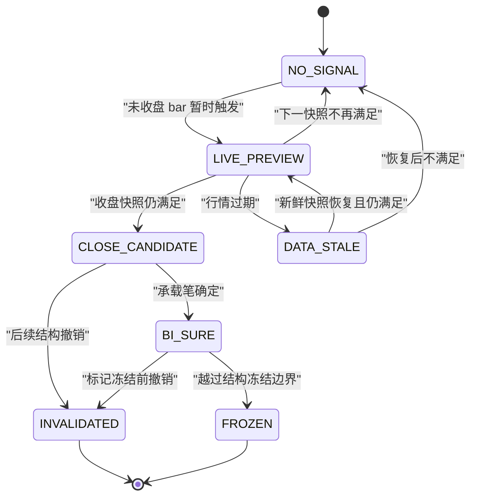
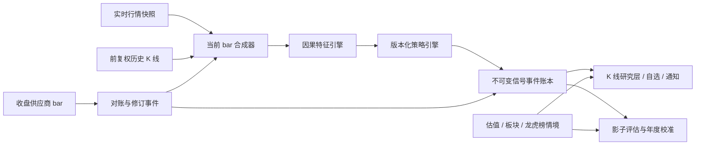

# K 线买卖点标注：严格调研、逐时点回放与产品设计方案

> **状态变更（2026-08-21）**：产品已决定不做买卖点。本文件保留为历史调研与方法论记录，当前实现依据改为：[MA5/10 与 MA20/60 变盘信号研究](ma-volume-turning-point-study-2026-08-21.md)。

> 版本：2026-08-21 · Research Design v1.0<br>
> 适用产品：Hanai Worth · 值见<br>
> 结论级别：**可进入研究/影子运行，不满足“可靠买卖指令”上线门槛**<br>
> 说明：本文是产品与工程研究，不构成投资建议，也不承诺任何收益。

## 0. 一页结论

我们应该引入的不是“在历史 K 线上补几个看起来很准的红绿点”，而是一个可审计的**信号证据层**：

1. **K 线上的标记必须表达“当时何时知道”**，不能把后来才确认的缠论买卖点回填到过去，却不告诉用户它当时尚不可知。
2. **最新 K 线允许实时判断，但只能显示为“盘中预览”**。实时价格、最高、最低、成交量每 15 秒变化，相关信号也必须允许撤销；收盘后才生成“收盘快照”，且缠论结构仍可能继续变化。
3. 第一阶段只上线默认关闭的“信号研究”开关，提供 `观察 / 盘中候选 / 收盘候选 / 承载笔已确定 / 已失效 / 结构已冻结` 状态，不直接写“建议买入/卖出”。
4. 当前最值得继续验证的是**日线第一类买点 B1 的候选形态**，但它仍不够资格成为硬买点：2021—2026 年逐年、逐时点回放，按 20 个交易日去重后共 225 个事件，扣费后正收益率 **55.11%**、加权平均净收益 **1.79%**；其中 2021、2023 年为负，只有 2022、2024 年的年度平均净收益 95% 聚类自举区间完全高于 0。
5. 缠论点位的“承载笔已确定”**不等于买卖点已确认**。本次逐根 K 线重放中，默认参数下 3,387 个初见暂定事件只有 38.41% 后来进入“承载笔已确定”，61.41% 在此之前消失；另有 950 个事件在承载笔确定后、标记冻结前消失。真正不会再消失的结构冻结，距首次出现中位数约 **152.5 根日 K**，对短期择时已经过晚。
6. 均线、成交量、估值、龙虎榜/游资数据都应作为**证据或情境**，不能混成一个未经验证的“综合准确率”。估值适合回答“贵不贵”，龙虎榜适合解释“谁在交易/事件强度”，都不能替代短线时点验证。
7. 在进一步实现前，先修复现有数据链路：当前个股报价会每 15 秒刷新，但日 K surface 的刷新逻辑明确跳过 `daily`，所以“最新日 K”不会随报价同步变化。实时信号不能直接建立在当前静态日 K 数组上。

最终产品形态建议命名为：**K 线信号研究层（Signal Evidence Layer）**。

---

为方便产品评审，下文先给出可执行的产品与工程方案，再给出完整调研、方法和实证证据。

## 1. 策略设计：从“买卖点”改成“证据驱动的决策状态”

### 1.1 第一阶段保留哪些策略

建议只注册以下三个研究定义，每个定义独立展示，禁止先混成一个神秘总分：

#### A. `CHAN_B1_DAILY_RESEARCH_V0`

- 输入：前复权日 K；固定 `chan.py` commit 与默认日线形态参数；
- 事件：B1 在逐时点计算中第一次实际出现；
- 状态：盘中预览、收盘候选、承载笔已确定、结构冻结、已失效；
- 评价：下一开盘起算的 5/10/20 日方向和扣费净收益；
- 作用：结构转折候选；
- 限制：不是完整多级别缠论交易系统，不能自动下单。

#### B. `MA_TREND_EVIDENCE_V0`

- 输入：用户当前选择的 MA5/MA10 或 MA20/MA60；
- 展示：价格在均线上/下、均线方向、交叉发生时间、与均线距离；
- 作用：验证结构候选是否与趋势位置一致；
- 限制：不单独生成“买/卖”，因为基线跨阶段不稳。

#### C. `VOLUME_CONTEXT_V0`

- 输入：当前成交量、20 日均量、量比、成交额可用性；
- 展示：缩量/常量/放量、相对分位，以及是否发生涨停不可买等可执行风险；
- 作用：解释突破、回踩和盘中信号质量；
- 限制：成交量不是方向本身，数据缺失时显示“缺少证据”，不能默认判 0。

估值、板块宽度、龙虎榜/游资作为 context，不计入 V0 的历史正确率。等每个增量过滤器完成独立消融实验后，才能进入策略版本。

### 1.2 决策输出词汇

产品对用户输出以下有限状态，而不是一句“可以买”：

| 决策 | 含义 | 是否可通知 |
|---|---|---|
| `数据不足` | K 线、实时 bar、成交量或时间戳不满足计算要求 | 仅故障/数据提示 |
| `无信号` | 规则未触发 | 否 |
| `观察` | 接近条件，但未触发 | 可选观察列表通知 |
| `盘中候选` | 当前未收盘 bar 暂时触发，下一次 tick 可撤销 | 低优先级、明确写“可能失效” |
| `收盘候选` | 已按收盘快照触发，但缠论结构尚可变化 | 可通知；不写建议仓位 |
| `承载笔已确定` | 该点所在笔已确定，点本身仍可能失效 | 可通知状态升级 |
| `风险增强` | 卖点/均线破位/量价异常等风险证据增加 | 可通知；不等同市价卖出 |
| `已失效` | 此前候选撤销或触发失效条件 | 必须通知曾收到该候选的用户 |
| `结构已冻结` | 历史标记不再重绘 | 仅归档，不应被解释为刚产生的交易机会 |

### 1.3 为什么不做一个“综合置信度 82 分”

目前没有足够数据证明 B1、均线、成交量、估值和龙虎榜之间的联合概率，也没有完成概率校准。把几个布尔条件加权成 82 分，会制造虚假精度。

第一阶段采用**证据清单**：每项只显示 `支持 / 反对 / 缺失 / 不适用`，同时展示来源和时间。等积累足够影子数据后，才可用可靠性图、Brier Score/Log Loss 检验概率校准。

## 2. 最新 K 线的实时判断设计

### 2.1 当前 bar 合成

交易时段内，实时引擎每次收到行情快照都生成：

```text
date      = 当前交易日
open      = 行情开盘价
high      = max(行情最高价, 最新价)
low       = min(行情最低价, 最新价)
close     = 最新价（界面文案：收盘/最新）
volume    = 当日累计成交量
amount    = 当日累计成交额；没有就标 null，不补 0
confirmed = false
asOf      = 行情源时间戳
```

MA 末端使用这根临时 bar 计算，因此盘中 MA 值同样是预览。15 秒轮询只是现有最低能力；若供应商允许 websocket/SSE，可升级为推送，但状态模型不变。

### 2.2 新鲜度和交易状态门控

建议阈值（作为产品规则，可配置）：

- 交易中且 `now - asOf <= 30s`：允许显示盘中候选；
- 30～90 秒：显示“行情延迟”，候选降级为观察；
- 超过 90 秒、时间戳倒退或市场状态未知：禁止生成实时方向信号；
- 集合竞价、午间休市、临停、停牌、涨跌停分别显示状态，不把最后一笔价格伪装成连续实时；
- 收盘后等待供应商结算 bar，合成 bar 与正式 bar 做差异比较，差异超阈值时重新计算并产生 `RECONCILED` 事件。

### 2.3 状态机



状态转换必须追加事件，不能直接覆盖数据库中的当前状态。这样才能回答：“昨天 14:32 用户看到过什么？何时消失？用的哪批数据和哪版算法？”

### 2.4 实时是否可以买/卖，系统应如何回答

对于最新 bar，V0 返回的是：

```text
当前判断：盘中 B1 结构候选（可撤销）
数据时间：14:32:15，延迟 8 秒
支持证据：最新价重新站上 MA20；量比 1.28；所在板块宽度改善
反对证据：MA20 仍低于 MA60；结构承载笔未确定
失效条件：最新价跌回 X；本日低点破 Y；行情超过 90 秒未更新
历史证据：同版本 20 日冷却 n=225，扣费正收益率 55.11%；年度不稳定
结论：观察，不是交易建议
```

如果用户将来选择接收信号通知，通知内容必须包含“盘中预览/收盘候选”前缀。预览被撤销时要发送失效更新，不能只报喜不报撤销。

---

## 3. K 线交互与视觉方案

### 3.1 页面结构

在现有“价格走势”面板增加：

1. **信号研究开关**：默认关闭，避免普通用户把研究层误认成建议；
2. **策略筛选**：`结构候选 / 均线事件 / 量价事件 / 龙虎榜事件`；
3. **状态图例**：盘中预览、收盘候选、笔确定、失效、冻结；
4. **独立信息栏**：复用目前 K 线悬浮信息独立区域，不再弹出遮挡 K 线的 tooltip；
5. **回放按钮**：选择任一历史日，只允许算法看到当日及以前数据，逐日播放首次出现与撤销。

### 3.2 标记规则

| 状态 | 建议视觉 | 原因 |
|---|---|---|
| 盘中候选 | 琥珀色空心三角 + `盘中` | 中性、可撤销，不与 A 股涨跌红绿混淆 |
| 收盘候选 | 琥珀色实心三角 | 比盘中更稳定，但不是最终确认 |
| 承载笔已确定 | 蓝色描边 + `笔` | 强调只是结构证据升级 |
| 已失效 | 灰色小叉；默认隐藏，可在“查看失效”开启 | 保留审计又避免默认噪声 |
| 结构已冻结 | 灰蓝色归档圆点 | 它是历史结构，不是当前交易机会 |
| 风险增强 | 橙色倒三角 | 不使用“卖”字，避免把弱证据表现成命令 |

不能只把点画在 `anchorDate`。若 `anchorDate != firstSeenAt`：

- 在锚点显示小型“回溯锚点”；
- 在实际发现日显示主标记；
- 两点之间用淡色虚线连接；
- 详情明确写“结构锚定于 08-01，首次可见于 08-08”。

### 3.3 独立信息栏内容

鼠标移入历史 K 时，信息栏切到该日；移开恢复最新日期。除现有日期、开盘、收盘/最新、最高、最低、成交量、MA 外，再增加：

- 当时可见的信号，而非今天回算后的最终信号；
- 策略名、版本、参数哈希和来源；
- 锚点时间、首次出现时间、状态升级/失效时间；
- 触发事实与失效条件；
- 数据源、复权口径、bar 是否收盘、行情时间；
- 同版本历史样本、观察窗口、扣费口径和置信区间；
- “此结果是研究信号，不构成投资建议”。

成交额没有数据时隐藏，不显示 0 或 `--` 参与策略。成交量为 0 时要区分停牌、集合竞价未成交和供应商缺失。

### 3.4 自选列表形态

当研究信号进入稳定影子期后，自选列表可异步追加：

- `当前状态`：无 / 盘中候选 / 收盘候选 / 风险增强；
- `首次出现` 和 `数据时间`；
- `证据摘要`：例如 `B1候选 · 价>MA20 · 量1.3x`；
- 单独刷新信号按钮，不阻塞行情列表；
- 估值差与信号分列，避免“低估 = 买点”的语义混淆。

## 4. 数据模型与服务边界

### 4.1 核心对象

```ts
type SignalState =
  | 'live_preview'
  | 'close_candidate'
  | 'underlying_bi_sure'
  | 'invalidated'
  | 'marker_frozen'
  | 'data_stale'

interface SignalDefinition {
  id: string
  version: string
  engine: string
  engineCommit?: string
  parameters: Record<string, unknown>
  parametersHash: string
  requiredFields: string[]
  causalPolicyVersion: string
  evaluationProtocolVersion: string
}

interface SignalEvent {
  eventId: string
  signalId: string
  securityId: string
  side: 'buy_context' | 'sell_context'
  type: 'created' | 'updated' | 'invalidated' | 'frozen' | 'reconciled'
  state: SignalState
  anchorBarDate: string
  firstSeenAt: string
  observedAt: string
  barConfirmed: boolean
  sourceSnapshotId: string
  triggerFacts: EvidenceFact[]
  invalidationFacts: EvidenceFact[]
}

interface SignalEvidenceStats {
  definitionId: string
  definitionVersion: string
  sampleCutoff: string
  horizon: number
  samples: number
  nonOverlapping: boolean
  positiveRateAfterCosts?: number
  meanNetReturn?: number
  clusterConfidenceInterval?: [number, number]
  annualFolds: AnnualMetric[]
}
```

`SignalDefinition` 一旦用于历史或线上信号就不可原地修改；参数调整必须生成新版本。`SignalEvent` 采用 append-only，当前状态由事件折叠得到。

### 4.2 组件关系



建议服务边界：

- `market-bar-builder`：合并历史 bar 与实时 quote，管理 confirmed/stale/reconciled；
- `signal-engine`：只接收截至当前时间的数据，输出候选事实，不负责 UI；
- `signal-ledger`：持久化每次状态变化；
- `signal-evaluator`：在未来到期后补写 5/10/20 日结果，不修改原事件；
- `signal-api`：提供当前态、时间线、证据统计；
- 客户端只负责呈现，不在浏览器重新解释规则。

### 4.3 一致性要求

同一 `SignalDefinition` 必须同时驱动：

- K 线标记；
- 自选列表筛选；
- 通知；
- 历史回放；
- 回测/影子统计。

不得为“图上更好看”在前端临时调整条件，否则历史正确率与用户看到的信号不再对应。

---

## 5. 无未来函数与防重绘规范

借鉴 TradingView 的 repaint 说明和通达信未来函数清单，发布前执行以下硬规则：

1. 第 `t` 个决策只能读取时间 `<=t` 的字段；
2. 禁止 BACKSET、REFX/REFXV、PEAK/TROUGH、ZIG 等需要未来数据或回写过去的函数进入可交易策略；
3. 若形态算法天然会回溯锚点，必须同时保存 `anchorDate` 与 `firstSeenAt`；
4. 历史回放必须和实时引擎走同一增量代码路径；
5. 当前 bar 的所有输出都带 `confirmed=false`，收盘后才可变为 `close_candidate`；
6. 承载笔确定和标记冻结是两个状态，禁止合并；
7. 任何消失的预览/候选都写 `invalidated`，不能从历史记录删除；
8. 修改数据供应商、复权、参数、费用、信号定义都必须升级版本并重新验证；
9. 回测中禁止在信号 bar 的收盘价假设成交；
10. 涨跌停、停牌、ST、科创/创业板不同涨跌幅必须进入可执行性模型。

建议增加自动化测试：对任意截断点 `t`，比较“全历史结果过滤到 t”与“只喂到 t 的实时结果”，两者可以在最终锚点上不同，但 `firstSeenAt` 之前绝不能出现事件；冻结事件之后不得消失。

## 6. 上线门槛与持续校准

### 6.1 V0 当前通过/未通过

| 门槛 | 建议标准 | B1 当前情况 |
|---|---|---|
| 因果可重放 | 100% 事件有 `firstSeenAt`，无未来函数 | 通过研究脚本验证 |
| 冻结不消失 | 冻结后 invariant violation = 0 | 通过 |
| 独立样本量 | 锁定规则后 ≥300 个非重叠事件 | 225，未通过 |
| 年度稳健 | ≥4/6 年净收益为正，且 ≥3/6 年平均净收益 CI 下界 >0 | 4/6 为正，但仅 2/6 CI 下界 >0，未通过 |
| 参数稳定 | 相邻合理参数的点位/绩效稳定，不靠单点参数 | Jaccard 0.356～0.619，未通过 |
| 实时撤销率 | 预览失效率可接受并向用户完整呈现 | 笔确定前失效 61.41%，未通过硬标记体验 |
| 独立前向验证 | 策略锁定后 60～90 个交易日影子运行 | 尚未开始 |
| 相对基线 | 净收益/风险显著优于同窗口无条件与简单持有 | 尚未证明 |

所以，V0 只允许研究层和影子日志，不允许：

- 默认开启；
- 发送“买入/卖出”命令式推送；
- 展示无样本说明的“成功率”；
- 自动交易；
- 用历史最终锚点冒充实时命中。

### 6.2 下一轮严格验证协议

1. **预注册**：先冻结 `CHAN_B1_DAILY_RESEARCH_V1` 的代码、参数、数据字段、失效规则、成本和评价窗口；
2. **影子运行**：连续 60～90 个交易日记录所有盘中预览、撤销、收盘候选和对账差异；
3. **扩大横截面**：覆盖至少 100 只、多个行业与大中小盘，不只使用指数样本；纳入退市/被剔除证券可获得的数据；
4. **滚动验证**：5 年训练、1 年验证向前滚动，年度结果独立展示；
5. **防多重检验**：参数/类型越多，使用 White Reality Check、SPA 或至少 FDR 修正，不能挑最好的一条直接宣布成功；
6. **层级 bootstrap**：按年份→股票聚类抽样，计算跨年度净收益区间；
7. **消融实验**：B1 单独、+MA、+成交量、+市场宽度分别测试，增量必须独立贡献；
8. **可执行回放**：有分钟数据时用次日开盘后可成交价、涨跌停队列和滑点敏感性；没有分钟数据就明确标记无法验证；
9. **实时质量指标**：预览→收盘保留率、收盘→笔确定率、撤销时延、行情陈旧率、供应商 reconcile 差异；
10. **漂移监控**：30/60/120 日滚动命中、净收益、覆盖率和参数漂移；触发阈值后自动降级为“仅观察”。

### 6.3 应展示哪些统计

每个策略版本至少展示：

- 样本截止日期、股票数、独立事件数；
- 5/10/20 日方向正确率；
- 扣费平均/中位净收益；
- 95% 聚类置信区间；
- 年度分解，而非只有总数；
- 最大回撤、Profit Factor、换手与信号覆盖率；
- 涨停无法买入、跌停无法卖出次数；
- 预览撤销率与结构冻结时延；
- 同期无条件方向基线和买入持有基线；
- 是否探索性选择、是否独立前向验证。

“55%”没有这些上下文，不应该出现在产品营销位。

## 7. 分阶段落地路线

### Phase 0：证据基础（先做）

- 修复/新增实时日 bar 合成与收盘 reconcile；
- 建立策略版本、数据快照、信号事件账本；
- 将现有研究脚本纳入可重复运行流程；
- 添加 causal lint 和冻结不消失测试；
- 不改普通用户 K 线默认体验。

验收：能对任一事件重放“当时看到什么”，实时 K 线、顶部最新价和均线末端一致。

### Phase 1：影子运行

- 后端实时计算，但前台只对开发/研究开关可见；
- 记录每个预览、撤销、收盘、笔确定、冻结事件；
- 每日生成数据质量与策略健康报告；
- 运行至少 60～90 个交易日。

验收：没有未来事件；撤销完整；供应商对账可追溯；样本达到门槛。

### Phase 2：信号研究层

- 上线默认关闭的 K 线标记、独立证据栏、时间线和回放；
- 首先只开放 B1 结构候选、均线证据、成交量证据；
- 估值和龙虎榜只做情境卡；
- 展示版本化历史统计和年度差异。

验收：用户无法把盘中预览误认成收盘确认；标记不遮挡 K 线；锚点与发现日可区分。

### Phase 3：自选筛选与提醒

- 同一规则驱动自选筛选和通知；
- 用户可选择只收“收盘候选”或同时收“盘中预览”；
- 所有预览撤销都发更新；
- 增加策略健康降级开关。

验收：通知、列表、K 线和回测版本完全一致。

### Phase 4：是否升级为明确买卖提示

只有在锁定版本的独立前向结果满足第 6 节门槛后，才讨论把“候选/风险”升级为更明确的行动提示。自动交易属于另一个合规、风控与执行项目，不在本方案授权范围内。

---

## 8. 复现材料

### 8.1 仓库内证据

- 常规策略脚本：[`../scripts/research/kline-signal-backtest.py`](../scripts/research/kline-signal-backtest.py)
- 常规策略完整结果：[`research-data/kline-signal-backtest-2026-08-21.json`](research-data/kline-signal-backtest-2026-08-21.json)
- 缠论逐 K 生命周期脚本：[`../scripts/research/chan-signal-stability.py`](../scripts/research/chan-signal-stability.py)
- 缠论 2024 cohort 完整结果：[`research-data/chan-signal-stability-2026-08-21.json`](research-data/chan-signal-stability-2026-08-21.json)
- 年度聚合脚本：[`../scripts/research/aggregate-chan-walk-forward.py`](../scripts/research/aggregate-chan-walk-forward.py)
- 2021—2026 年度滚动结果：[`research-data/chan-signal-walk-forward-2026-08-21.json`](research-data/chan-signal-walk-forward-2026-08-21.json)

### 8.2 运行方式

```bash
python3 -m venv /tmp/hanai-signal-research
/tmp/hanai-signal-research/bin/pip install baostock

/tmp/hanai-signal-research/bin/python \
  scripts/research/kline-signal-backtest.py \
  --output docs/research-data/kline-signal-backtest-2026-08-21.json

git clone https://github.com/Vespa314/chan.py /tmp/hanai-chan-research
git -C /tmp/hanai-chan-research checkout \
  429d6ed3043e27c93a003ba2b10e70a05575e1f5

for year in 2021 2022 2023 2024 2025 2026; do
  /tmp/hanai-signal-research/bin/python \
    scripts/research/chan-signal-stability.py \
    --chan-root /tmp/hanai-chan-research \
    --cohort "$year" \
    --analysis-end "$year-12-31" \
    --configurations official_default_daily_morphology,strict_divergence_0_9 \
    --output "/tmp/chan-signal-stability-$year.json"
done

/tmp/hanai-signal-research/bin/python \
  scripts/research/aggregate-chan-walk-forward.py \
  --input-dir /tmp \
  --output docs/research-data/chan-signal-walk-forward-2026-08-21.json
```

2026 的 `analysis-end` 虽写到年末，底层数据仍只到 2026-08-20；输出元数据会记录实际截止日期。复现时 BaoStock 成分股接口或历史数据若发生供应商修订，应通过 artifact 中的 SHA-256 判断是否还是同一实验。

## 9. 主要外部来源

### 9.1 平台与工具

- TradingView：[Repainting](https://www.tradingview.com/pine-script-docs/concepts/repainting/)、[Execution model](https://www.tradingview.com/pine-script-docs/language/execution-model/)、[Strategies](https://www.tradingview.com/pine-script-docs/concepts/strategies/)、[Bar Magnifier](https://www.tradingview.com/support/solutions/43000669285-what-is-bar-magnifier-backtesting-mode/)、[Deep Backtesting](https://www.tradingview.com/support/solutions/43000666265-how-deep-backtesting-works/)、[Bar Replay](https://www.tradingview.com/support/solutions/43000754966-demo-features-on-tradingview/)、[Strategy alerts](https://www.tradingview.com/support/solutions/43000481368-strategy-alerts/)
- TrendSpider：[Strategy Tester 说明](https://help.trendspider.com/kb/strategy-tester/understanding-strategy-tester-from-trendspider)、[创建策略](https://help.trendspider.com/kb/strategy-tester/accessing-and-using-the-strategy-tester)、[Alerts FAQ](https://help.trendspider.com/kb/alerts/alerts-faq-markdown-html)
- 通达信：[公式平台](https://help.tdx.com.cn/gspt/)、[函数列表与未来函数标识](https://help.tdx.com.cn/gspt/docs/markdown/redword/functionlist.html)、[专家系统公式](https://help.tdx.com.cn/gspt/docs/markdown/tdxgs-1d1kngsmd4kd8.html)、[官方功能介绍](https://www.tdx.com.cn/ugt/gnjs.html)
- 迅盈：[产品官网](https://xunyingjiaoyi.com/)、[使用说明](https://xunyingjiaoyi.com/show.asp?id=440)
- GuruFocus：[GF Value Chart 方法说明](https://www.gurufocus.com/news/1474914/behind-the-numbers-the-gf-value-chart)

### 9.2 缠论文本与实现

- 缠论原文镜像/整理：[第 20 课](https://baiyunju.cc/1455)、[第 32 课](https://baiyunju.cc/1486)、[第 33 课](https://baiyunju.cc/1488)、[第 37 课](https://baiyunju.cc/1638)、[第 44 课](https://baiyunju.cc/1815)、[第 53 课](https://iczsc.com/read/053/)、[第 58 课](https://baiyunju.cc/1859)、[第 86 课](https://baiyunju.cc/1939)、[原文合集 PDF](https://xqdoc.imedao.com/15621999f6b25803feb29d4c.pdf)
- 开源实现：[`Vespa314/chan.py`](https://github.com/Vespa314/chan.py)、[`hugo2046/hugo_chan`](https://github.com/hugo2046/hugo_chan)、[`Ye-Yu-Mo/chanlun_pine`](https://github.com/Ye-Yu-Mo/chanlun_pine)、[`neil-pan-s/one-quant-doc`](https://github.com/neil-pan-s/one-quant-doc)、[`rucmeteor1025/chanlun-skills`](https://github.com/rucmeteor1025/chanlun-skills)
- 二次讲解，仅作辅助：[YouTube 第 29 课](https://www.youtube.com/watch?v=D3NfLx1HxMk)、[YouTube 第 58 课](https://www.youtube.com/watch?v=B2uam6GhgAw)

### 9.3 游资、交易约束与统计警告

- 上交所：[2026 年交易规则](https://www.sse.com.cn/lawandrules/sselawsrules2025/fund/trading/c/c_20260424_10817739.shtml)、[投资者交易费用](https://one.sse.com.cn/onething/gptz/)
- 深交所：[交易收费](https://www.szse.cn/marketServices/deal/payFees/index.html)
- 税务机关：[证券交易印花税说明](https://shanxi.chinatax.gov.cn/web/detail/sx-11400-545-1780448)
- 东方财富：[龙虎榜](https://data.eastmoney.com/stock/lhb.html/)、[机构统计](https://m.data.eastmoney.com/lhb/jgsearch/)
- 涨跌停与可交易性研究：[Price limits in the Chinese stock markets](https://arxiv.org/abs/1503.03548)
- 数据挖掘警告：[Profitability of simple technical trading rules of Chinese stock exchange indexes](https://arxiv.org/abs/1504.04254)

## 10. 阶段产品决策

**建议立项，但立项名称应是“K 线信号研究层”，不是“AI 买卖点”。**

首版只做三件事：

1. 修复实时日 K 数据一致性，建立可审计的当前 bar 与收盘对账；
2. 以 B1 为结构研究候选，配合已有均线、成交量证据，在 K 线上区分盘中预览、收盘候选、笔确定、失效和冻结；
3. 先运行影子验证，达到样本、年度稳定、置信区间和参数稳定门槛后，再决定是否向普通用户开放提醒。

这套方案对 Hanai 的真正价值不是多画几个符号，而是把**来源、当时可知性、实时变化、失效、历史证据和不确定性**放进同一个产品闭环。它能让系统比常见的“事后神图”更可信，也给以后加入更多策略、扫描器和提醒留出统一、可验证的基础。

## 11. 本报告到底回答什么

用户提出的目标包含三个不同问题，必须拆开验证：

- **理论问题**：缠论、均线、成交量、游资等方法各自声称什么？
- **工程问题**：历史图上的某个点，在那个交易日真的已经可见，还是后来回填的？
- **产品问题**：最新一根 K 线不断变化时，界面应该如何表达“可能成立、尚未确认、已经失效”？

本文对“正确率”采用以下严格定义，避免混用：

- **配对交易胜率**：按规则入场和退出、扣除成本后的完整交易净收益大于 0 的比例。
- **买点方向正确率**：信号出现后下一交易日开盘作为可交易起点，在固定 5/10/20 日后净收益大于 0 的比例。
- **卖点方向正确率**：同一起点后价格下跌的比例；它不等于做空收益，也不等于真的能以该价格卖出。
- **盘中命中**：尚未收盘的当前 K 线满足条件。它只是预览，不能和收盘信号、结构冻结信号混算。

报告中凡出现“准确率/正确率”，都会同时给出样本数、时间窗口、成本口径以及尽可能给出按股票聚类的置信区间。

## 12. 证据等级与检索原则

本次调研按以下可信度排序：

| 等级 | 证据 | 用途 | 不能证明什么 |
|---|---|---|---|
| A | 交易所、税务机关、产品官方技术文档 | 交易约束、平台真实能力、回测机制 | 某策略一定盈利 |
| B | 固定 commit 的开源实现和可重放代码 | 算法行为、重绘与状态变化 | 实现等同于理论唯一标准 |
| C | 缠论原文镜像/整理、课程原始资料 | 概念定义与语境 | 经统计验证的收益 |
| D | YouTube/B 站讲解、营销页面 | 发现候选思路、理解产品包装 | 独立正确率、可复制收益 |

YouTube 视频和迅盈营销描述只作为线索；核心规则必须回到原文、官方文档或可执行代码核对。理论文本里的“必然”“无风险”等表述不直接当作统计结论。

## 13. 对现有 Hanai 产品的审计

### 13.1 已有能力

当前产品已经具备一套很适合作为研究底座的能力：

- 分时、日 K、周 K、月 K；
- 日 K 使用东方财富前复权参数 `fqt=1`，腾讯作为备用源；
- MA5/MA10 与 MA20/MA60 两种均线模式；
- 成交量、缩略时间轴、悬浮信息独立栏；
- 日 K 左拖分段加载更早历史，周/月 K 请求完整历史；
- 个股报价约每 15 秒刷新；
- 价值大师/GuruFocus 合理估值数据与缓存；
- 自选、研判、专家体系和本地优先的数据架构。

因此，本项目不需要另造一张 K 线图，应该在现有图表上增加可关闭的研究层，并复用已有均线、成交量、估值和数据来源元信息。

### 13.2 必须先修的实时数据缺口

现有个股页有两条刷新链路：

1. `refreshQuote()` 每 15 秒更新报价；
2. `refreshSurface()` 更新图表 surface，但代码在 `chart === 'daily'` 时直接返回。

这意味着“最新价”会变化，而日 K 数组最后一根 bar 可能保持初次加载时的值。若直接在 `detail.daily` 上跑实时策略，会出现：

- 顶部最新价已经变化，K 线收盘/最新仍旧；
- 均线末端没有包含当前最新价；
- 盘中信号判断基于陈旧 bar；
- 收盘后数据供应商回补时，信号无审计记录地跳变。

正确做法是新增**当前 bar 合成器**：以最近一个已结算的前复权日 K 为历史，使用实时行情的开、高、低、最新价、成交量、成交额合成一根 `unconfirmed` 日 K；收盘后重新获取供应商日 K，做 reconcile，并保留前后差异。

### 13.3 前复权与历史加载

现有“前复权 + 左拖加载更早数据”方向正确。买卖点引擎必须始终使用与屏幕一致的复权口径，不能让图上是前复权、计算却是未复权。历史加载解决的是数据长度，不解决未来函数问题；是否重绘仍取决于信号算法有没有使用未来 K 线。

---

## 14. 参考产品与仓库：分析、产品价值、引入后的形态

| 参考对象 | 核心能力与核对结果 | 对 Hanai 的价值 | 引入后的产品形态 |
|---|---|---|---|
| TradingView | 官方明确区分 historical/realtime bar，说明实时 bar 会 rollback、脚本会 repaint；策略回测、Bar Magnifier、Deep Backtesting、Bar Replay 和 alerts 是分开的能力 | 提供“实时预览 ≠ 收盘确认”和回放验证的标准模型 | 信号状态标签、回放模式、策略版本页、实时预览的虚线/空心标记 |
| TrendSpider | Strategy Tester 把可视条件、回测、提醒和 scanner 串成同一套规则 | 避免图上、提醒、筛选器三套逻辑漂移 | 统一 `SignalDefinition`，同一版本驱动 K 线、列表筛选和通知 |
| 通达信 | 官方公式系统可写买卖点并做历史/模拟/参数测试；函数列表明确标记 BACKSET、REFX、PEAK/TROUGH、ZIG 等未来函数 | 非常适合借鉴“公式能力 + 未来函数静态检查” | 内部规则 DSL/AST、发布前 causal lint、禁止函数清单 |
| 迅盈 | 官网宣称 30+ 策略、自动交易、提醒与止损，同时明确演示/辅助属性和风险自担；未找到足够公开、可复核的逐笔正确率证据 | 可借鉴告警、执行桥和运行状态，不应把营销策略当信号真值 | 后期提醒中心、券商跳转/执行桥；不进入第一阶段信号来源 |
| 价值大师 / GuruFocus | GF Value 组合历史估值倍数、历史回报和分析师预期，并提示 value trap 风险 | 提供贵/合理/低估的中长期背景，帮助用户理解短期点位所处估值区 | K 线右侧“估值情境”卡、信号详情里的估值分位；不直接触发短线买卖 |
| 缠论原文与 `Vespa314/chan.py` | 原文定义一二三类买卖点；开源实现支持逐 K 输入、多参数形态计算，并明确当前帧点位可能移动/消失 | 提供结构语言，但同时暴露了最需要解决的重绘与确认边界 | 结构候选层、锚点/发现时间双时间轴、暂定/笔确定/冻结状态 |
| `hugo_chan`、`chanlun_pine`、`one-quant-doc`、`chanlun-skills` | 代表 Python 研究、Pine 可视化、量化文档和 Agent 技能化的不同产品方向 | 验证缠论不是一个唯一公式，而是实现、参数和产品表达的组合 | 插件化策略适配层；所有实现必须固定版本并单独回测 |
| 龙虎榜 / 游资 | 交易所规则与东方财富数据能提供异常交易、机构席位等事后事件；日 K 无法证明涨停排队和席位成交可复制 | 是事件解释与风险背景，不是日 K 单点择时真值 | “龙虎榜事件”图层、席位/净买入摘要、次日可交易性警告 |
| YouTube/B 站课程 | 有缠论第 29、58 课等二次讲解，适合帮助理解，但视频本身不提供可审计回测 | 用作内容教育和术语解释 | 帮助中心的概念卡；策略定义仍链接原文和固定实现 |

关键产品判断：

- **TradingView/TrendSpider/通达信**贡献的是可信的工具链设计；
- **缠论/均线/成交量**贡献候选规则；
- **价值大师、龙虎榜/游资**贡献上下文；
- **迅盈**贡献未来的提醒/执行形态；
- 这些层不能被拼成一个来源不明的“AI 综合买卖点”。

## 15. 缠论买卖点：理论、实现和可交易时间必须分开

### 15.1 原文层面的简化定义

在不替代多级别递归定义的前提下，可把三类点理解为：

- **第一类买点 B1**：下跌趋势中，最后一段向下离开与此前走势发生背驰，形成趋势转折候选；第一类卖点反向。
- **第二类买点 B2**：B1 后第一次次级别回调不再创出 B1 的新低；第二类卖点反向。
- **第三类买点 B3**：向上离开中枢后，第一次次级别回抽不重新进入中枢；第三类卖点反向。

真正的定义涉及分型、笔、线段、中枢、走势类型、背驰与级别递归。只用日 K 做一个“突破回踩”并称为 B3 是不严谨的。因此基线里的 `center_retest_proxy` 明确叫**中枢回踩代理**，不冒充完整 B3。

### 15.2 `chan.py` 中三个容易混淆的时刻

固定研究实现为 [`Vespa314/chan.py`](https://github.com/Vespa314/chan.py) commit `429d6ed3043e27c93a003ba2b10e70a05575e1f5`。逐根 K 线喂入后，一个点至少有四个时间：

| 时间 | 含义 | 当时能否交易 |
|---|---|---|
| `anchorDate` | 标记最终画在历史哪根 K 上 | 不一定；可能是后来才回溯确定的锚点 |
| `firstSeenAt` | 在只看截至当时数据时第一次出现 | 可以作为暂定观察信号，但可能移动/消失 |
| `underlyingBiSureAt` | 承载该点的笔 `bi.is_sure` | 不是买卖点冻结，仍可能消失 |
| `markerFrozenAt` | 锚点越过引擎的 `last_sure_pos` 结构冻结边界 | 可作为不会重绘的历史标记，但通常已严重滞后 |

最重要的纠正是：**`point.bi.is_sure` 只说明承载笔已确定，不代表 `CBS_Point` 已最终确认。** `CBS_Point` 本身没有 `is_sure`。产品若把二者都写成“确认买点”，会产生实质误导。

### 15.3 为什么静态历史图看起来特别准

完整历史一次性计算时，算法已经看到了后续 K 线，最终点位会画回过去的 `anchorDate`。如果界面只显示该点而不显示 `firstSeenAt`，用户会自然误以为自己在锚点当天就知道答案。

本次验证没有在完整历史结果上直接统计，而是执行**因果增量重放**：第 `t` 次只向引擎提供 `0...t` 的 bar，记录点第一次出现、消失、笔确定和冻结的时间，再从实际发现后的下一开盘计算结果。

---

## 16. 回测与逐时点验证方法

### 16.1 数据与样本

- 数据源：BaoStock 日线；前复权 `adjustflag=2`；截至 2026-08-20。
- 股票池：每个年度从当时的沪深 300、中证 500 成分中确定性抽取各 20 只，每年 40 只；整个年度滚动 universe 跨年度共有 249 个不重复证券、694,003 根 bar。
- 常规策略固定分段表：2015 cohort 用于 2015—2020 训练，2021 cohort 用于 2021—2023 验证，2024 cohort 用于 2024—2026-08-20 测试；每段各 40 只。脚本另保留 2021—2026 按当年 cohort 重新选参和评价的 walk-forward 明细。
- 缠论年度重放：2021—2026，每年使用该年年初的 point-in-time 40 股 cohort，只统计该年度实际发现的事件。
- 数据清单记录证券、行数、首末日期和 SHA-256，不在仓库分发供应商原始行情。

Point-in-time 样本降低了“拿今天成分股回测过去”的生存者偏差，但没有完全消除指数选择、退市股覆盖、行业分布和供应商质量偏差。

### 16.2 成交与成本假设

- 信号在日 K 收盘产生，最早在下一交易日开盘执行；
- 买入后遵守 A 股 T+1；
- 下一开盘估计为涨停时跳过买入；跌停开盘不能卖出时延迟退出；
- 双边佣金各 0.03%、过户费各 0.001%、卖出印花税 0.05%；
- 双边滑点各 0.10%；
- 不使用同一根 K 的最高/最低假装成交；
- 禁止未来函数、pivot 后填和从回溯锚点计算收益。

手续费口径参考上交所投资者费用说明、深交所收费页面和税务机关证券交易印花税说明。不同券商的最低佣金、实际过户费和流动性冲击可能更高，因此本回测仍偏乐观。

### 16.3 防止重复事件抬高样本量

缠论暂定点可能连续多日移动锚点并反复出现。除了原始事件数，本报告重点使用**同一证券同一方向按评估周期冷却**的非重叠统计：例如评价 20 日结果时，一个信号触发后 20 个交易日内不再计同方向新事件。

置信区间使用按股票聚类的 bootstrap，避免把同一股票的大量相邻事件当作完全独立样本。年度结果分别展示，不用一个总平均掩盖市场状态变化。

### 16.4 候选规则

常规基线覆盖四族完全因果的规则：

1. **MA 交叉**：MA5 上穿 MA10，趋势过滤为收盘高于 MA60 且 MA20>MA60，量比 20 日均量至少 1.2；退出为 MA5<MA10 或收盘低于 MA20，最长持有 40 日。
2. **趋势回踩**：MA20>MA60，最近 5 日触及 MA20 附近，前一日不在 MA20 上方、当日重新收上；退出为连续两日低于 MA20 或 MA20<MA60。
3. **放量突破**：收盘突破此前 40 日高点、MA20>MA60、成交量至少 20 日均量 1.5；退出为低于 MA10 或 MA20<MA60。
4. **中枢回踩代理**：放量突破后 5 日内回踩突破位、容差 1%、不破位并站在 MA20 上方；它只是 causal proxy，不是完整缠论 B3。

参数只用训练段选择，之后冻结到验证、测试段。

## 17. 实证结果

### 17.1 常规均线/成交量基线

下表的“胜率”是有入场、有退出、扣费后的完整交易胜率；“平均净收益”是单笔交易平均值。

| 规则 | 2021—2023 验证 | 2024—2026 测试 | 参数稳定性 | 判断 |
|---|---|---|---|---|
| MA 交叉 | 209 笔；胜率 30.62%；平均 -0.92%；中位证券 CAGR -1.63% | 180 笔；胜率 41.11%；平均 +1.16%；中位证券 CAGR +0.27%；平均收益 95% CI -0.92%～+3.65% | 6/6 变体测试平均为正，但仅 2/6 中位证券 CAGR 为正 | 最值得保留为基线，但跨阶段不稳，不能独立标硬买点 |
| 趋势回踩 | 374 笔；胜率 25.94%；平均 -0.78%；中位证券 CAGR -5.12% | 305 笔；胜率 31.48%；平均 +0.79%；中位证券 CAGR -1.31% | 0/6 变体中位证券 CAGR 为正 | 适合做趋势证据，不适合作为单独策略 |
| 放量突破 | 241 笔；胜率 29.05%；平均 -1.36%；中位证券 CAGR -4.03% | 221 笔；胜率 33.03%；平均 +0.34%；中位证券 CAGR -2.14% | 0/8 变体中位证券 CAGR 为正 | 交易拥挤、涨停不可买问题明显；只做事件证据 |
| 中枢回踩代理 | 178 笔；胜率 18.54%；平均 -2.29%；95% CI 完全为负 | 133 笔；胜率 36.84%；平均 +0.58%；中位证券 CAGR -0.95% | 0/16 变体中位证券 CAGR 为正 | 不能当 B3，也不应上线 |

MA 交叉测试段看似转正，但同期 point-in-time 样本买入持有的中位 CAGR 为 9.51%，而 MA 策略中位证券 CAGR 只有 0.27%。这进一步说明“部分单笔均值为正”不等于它提供了有竞争力、可上线的超额收益。

这和学术研究的警告一致：针对中国股指的简单技术规则，未经 data-snooping 修正时可能显示收益，经 Reality Check 和成本处理后优势会消失。

### 17.2 缠论标记生命周期：重绘是主问题

2024 cohort、40 只股票、默认日线形态参数的逐根重放结果：

| 指标 | 结果 | 产品含义 |
|---|---:|---|
| 事件总数 | 3,409 | 静态图中的点远多于独立交易机会 |
| 初见时为暂定 | 3,387 | 几乎所有点第一次出现都未冻结 |
| 暂定后承载笔确定 | 38.41% | `bi.is_sure` 不是常态 |
| 暂定后在笔确定前消失 | 61.41% | 盘中/初见标记必须允许撤销 |
| 笔确定后、冻结前又消失 | 950 | “笔已确定”不能标成“买点确认” |
| 最终进入标记冻结 | 7.35% | 真正不重绘的比例很低 |
| 冻结后消失 | 0 | `last_sure_pos` 是可靠的历史冻结边界 |
| 首次出现→笔确定中位等待 | 1 根日 K | 可以很快增加一个结构证据，但仍非最终 |
| 首次出现→标记冻结中位等待 | 152.5 根日 K | 对短期买卖点过晚，只适合历史归档 |

参数敏感性同样明显。默认 vs 严格背驰参数的锚点 Jaccard 为 0.619，默认 vs 放宽参数为 0.576，严格 vs 放宽仅 0.356。换句话说，“图上有哪个点”高度依赖实现与参数版本，产品必须把版本写进每个信号。

### 17.3 所有缠论点混在一起，没有可靠优势

默认参数的所有初见点，按方向评价 20 日结果：

- 3,324 个可评价事件；方向正确率 52.17%；按股票聚类 95% CI 为 49.68%～54.84%；
- 平均方向收益 0.66%，95% CI -0.72%～1.97%，跨 0；
- 20 日冷却去重后 659 个事件，方向正确率 51.29%，平均方向收益 0.24%，置信区间仍跨 0。

所以“把所有一二三类买卖点都画出来”既会造成视觉噪声，也没有实证支持。

### 17.4 B1 是当前最强候选，但仍未通过上线门槛

B1 是在探索多个标签后表现最强的类型，因此存在**多重比较/事后选择偏差**。后续 2021—2026 年度切片是稳定性诊断，不是完全独立、事先注册的最终检验。

下表采用默认日线形态、B1 第一次实际出现、下一开盘起算、20 日评价、同证券 20 日冷却、扣除往返费用和滑点：

| 年度 | 样本 | 扣费后正收益率 | 平均净收益 | 平均净收益 95% 聚类 CI |
|---|---:|---:|---:|---:|
| 2021 | 34 | 44.12% | -1.27% | -3.79%～+0.68% |
| 2022 | 51 | 70.59% | +3.13% | +0.37%～+5.75% |
| 2023 | 45 | 40.00% | -1.12% | -2.94%～+0.91% |
| 2024 | 42 | 57.14% | +5.59% | +1.41%～+10.98% |
| 2025 | 22 | 68.18% | +3.85% | -0.14%～+7.71% |
| 2026（截至 08-20） | 31 | 51.61% | +0.56% | -3.40%～+4.99% |
| 描述性汇总 | 225 | **55.11%** | **+1.79%** | 不用汇总值替代年度稳定性 |

观察：

- 4/6 年平均净收益为正，但只有 2/6 年的置信区间完全高于 0；
- 2021 和 2023 明确显示市场状态切换会使规则失效；
- 2025、2026 样本很小，2026 还是未完整年度；
- 原始、不去重的 1,092 个事件扣费后正收益率 61.97%，但连续移动/重复事件显著放大了样本，不能作为产品宣传准确率；
- 等到承载笔确定后再评价，并未解决年度不稳：20 日冷却共 215 个事件，扣费后正收益率 55.35%、加权平均净收益 2.97%，2023 仍为负；
- 等到标记冻结才不重绘，但等待约 153 根日 K，已经不再是实用的短线确认。

因此，B1 只能叫**“结构候选”或“B1 研究信号”**，不能叫“可靠买点”。

### 17.5 卖点结果

卖点整体也没有达到可发布标准。默认参数的 `sell:1p` 在 20 日冷却样本中共 73 个事件，方向正确率 60.27%，但平均方向收益只有 +0.14%，年度样本仅 7～19 个且置信区间很宽。严格参数、笔确定后的部分卖点看起来更强，但样本更小，容易被少数股票和行情主导。

结论：第一阶段不要画红色“卖”或绿色“买”的交易命令。卖出侧可先呈现“风险增强/结构转弱”的证据，不做确定性指令。

---

## 18. 验收结论

| 用户要求 | 本次交付 |
|---|---|
| 网罗并分析先进产品/工具 | 已覆盖 TradingView、TrendSpider、通达信、迅盈、GuruFocus/价值大师、缠论实现、龙虎榜/游资、YouTube 与相关开源仓库 |
| 解释参考对象对产品的价值 | 第 14 节逐项给出能力、核对结果、Hanai 价值与引入后的产品形态 |
| 严格回溯、不断校正正确性 | 已实现无未来数据的逐时点重放、成本/涨跌停/T+1 约束、参数敏感性、按股票聚类区间与 2021—2026 年度滚动验证 |
| 最新 K 线实时买卖判断 | 第 2 节给出当前 bar 合成、新鲜度门控、盘中撤销、收盘对账与完整状态机 |
| 输出 K 线买卖点设计方案 | 第 1～7 节给出策略、交互、数据模型、架构、风险门槛和分阶段落地方案 |
| 描述策略来源、核对方式与正确率 | 第 9、15～17 节列明来源、固定 commit、重放方法、样本和年度结果；未把探索结果包装成已证实收益 |

本次研究支持“开始建设可审计的研究信号基础设施”，不支持“立即上线确定性买卖点”。下一项真正有信息增量的工作不是再挑一组参数，而是锁定 V1 后做 60～90 个交易日的前向影子运行。
