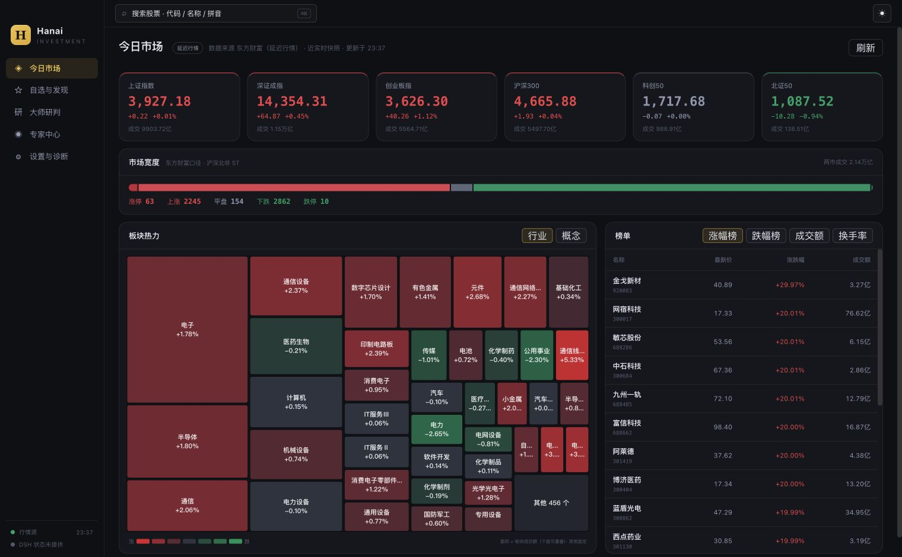
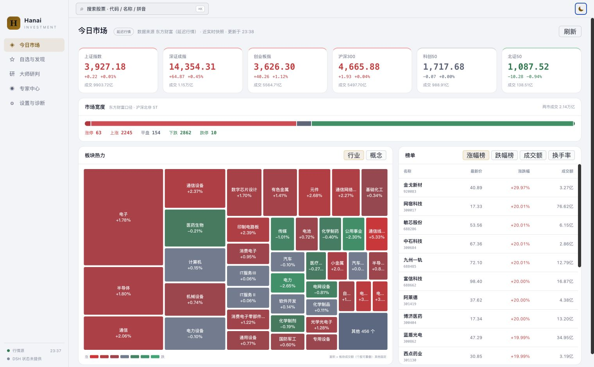
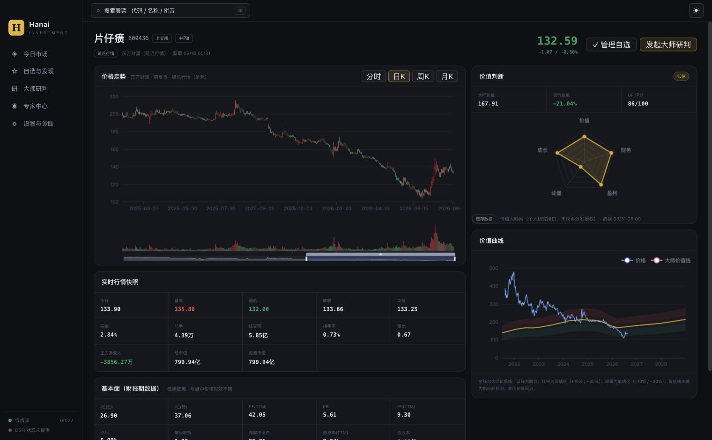

# Hanai Worth · 值见 DSH 启动与验收报告

> 最近适配验收：2026-10-01；首版验收：2026-08-23

## 1. 结论

Hanai Worth · 值见当前以兼容包名 `hanai-investment-dsh` 和独立 DSH Profile 运行，不修改官方 `web` Profile。客户端是 Hanai Worth 自有 React 工作台，DSH 提供 Agent、模型、工具、Session 与会话持久化。新版业务数据只写入 `~/.hanai-investment-dsh`，不会检测、读取或导入旧版数据。

## 2. 已验证环境

| 组件 | 实测版本 |
| --- | --- |
| Node.js | `v22.22.0` |
| pnpm | `11.7.0` |
| DeepSeek Harness | `0.2.0-rc.2` |
| Profile | `hanai-investment` |
| 默认监听 | `http://127.0.0.1:3080` |

如果本机 pnpm 不是 11.7.0，可以先执行：

```bash
corepack enable
corepack prepare pnpm@11.7.0 --activate
pnpm --version
```

## 3. 首次安装与启动

在仓库根目录执行：

```bash
npm install -g @deepseek-ai/dsh@0.2.0-rc.2
pnpm install --frozen-lockfile
pnpm run build
pnpm run profile:install -- --package .
pnpm run profile:verify
dsh --profile hanai-investment
```

终端出现以下输出后，使用终端中的完整地址首次打开浏览器。DSH 0.2 会用启动 token 换取浏览器会话，再重定向到不含 token 的地址：

```text
dsh web: http://127.0.0.1:3080/?token=<本次启动 token>
```

安装器会执行以下装配与迁移：

1. 安装当前 Hanai 插件包；
2. 把 Bundle 顺序规范化为 `@deepseek-ai/dsh-base` → `@deepseek-ai/dsh-web-app` → `hanai-investment-dsh`；
3. 从 Profile dependencies 中移除早期版本错误安装的 `@deepseek-ai/dsh-web-app`，再由 pnpm 清理它带入的本地 DSH runtime 副本；
4. 使用当前 CLI 的内存模块解析机制，校验 Profile 与 `dsh-agent-loop` 解析到同一个真实 `@deepseek-ai/dsh-tools` 模块。

Base 和 Web App 是当前 DSH CLI 自带的 installation-owned Bundle，不应安装成 Profile dependency。Profile 中只保留 `hanai-investment-dsh` 这一项直接依赖。

安装器明确拒绝 `web`、`headless`、`node_modules` 等保留名称，也会拒绝覆盖包含无关插件的同名 Profile。

## 4. 第一次进入后的设置

1. 打开左侧“设置与诊断”。
2. 在“DeepSeek API Key”卡片写入 Key 并点击“安全保存”。输入框提交后会清空；页面和 RPC 都不会回显明文。
3. 在“默认模型”选择 DSH 当前提供的模型并保存。
4. 确认数据源、证券主数据和本地存储状态。
5. 回到“大师研判”，选择股票和一位大师开始研判；或进入“专家对谈”，不选股票直接开始开放讨论。

报告封存完成后，详情页默认仍展示正式报告；切换“继续对话”会复用生成该报告的同一个 `dshSessionId`。专家开放对谈使用独立业务索引，但消息、工具和 Turn 历史仍只由对应的 DSH Session 持有，不会创建第二个本地消息库。

## 5. 日常启动与停止

后续只需：

```bash
dsh --profile hanai-investment
```

端口被占用时可以指定其它 loopback 端口：

```bash
dsh --profile hanai-investment --port 3081
```

在运行终端按 `Ctrl+C` 停止。原生 DSH Web 仍使用：

```bash
dsh web
```

两个 Profile 可以使用不同端口并行运行。

## 6. 数据与凭据边界

| 数据 | 所有者 | 默认位置 |
| --- | --- | --- |
| 自选、证券主数据、研判/专家对谈索引、报告、行情/估值缓存 | Hanai | `~/.hanai-investment-dsh` |
| DeepSeek Key、默认模型、Session 消息、工具事件、附件 | DSH | 当前 `$DSH_HOME` |

实测新数据根目录权限为 `0700`，SQLite 文件权限为 `0600`。旧版目录保留原状，新版没有数据导入入口。

## 7. 自动化验收

完整门禁命令：

```bash
pnpm run check
```

它依次覆盖 TypeScript、单元/集成测试、Host 与 Client 生产构建、npm tarball allowlist、DSH ModuleLoader 协议、source map、三方许可证、私有绝对路径和旧数据路径隔离。

首版最终运行结果（2026-08-23；本次适配结果见第 12 节）：

| 门禁 | 结果 |
| --- | --- |
| `pnpm run typecheck` | 通过 |
| `pnpm run test` | 27 个测试文件、187 项测试全部通过 |
| `pnpm run build` | Host、Client 与 Profile tools 构建通过 |
| `pnpm run pack:check` | 71 个发布文件通过 |
| `git diff --check` | 通过 |

五个专家 Skill 均通过结构校验，其中新增孙宇晨视角还通过 `skill-creator` 的 `quick_validate.py`；原始迁移资产中的 51 个文件继续由 SHA-256 清单校验，发布包包含全部 8 个脚本。已在 rc.2 Host/Web 上完成 Profile 启动、页面加载、Session 创建与 prompt/event 链路 smoke；临时无 Key 环境中的模型调用按预期停在凭据校验。

另外已使用全新的临时 `DSH_HOME` 实际执行：

```bash
pnpm run profile:install -- --package .
pnpm run profile:verify
```

验证结果为独立 Profile 按 Base → Web App → Hanai 顺序组合，只有 Hanai 是 Profile dependency，DSH runtime 不存在 Profile-local shadow，且没有写入官方 `web` Profile。

## 8. 浏览器验收

首版已在真实 DSH Host/Web 中完成以下检查：

- 1520 × 940：侧栏 176px、顶栏 46px、页面无水平溢出；
- 1280 × 720：Dashboard 和股票详情无水平溢出；
- 亮色与黑夜模式：只改变语义色彩，布局尺寸不变并可持久化；
- Dashboard：六指数、五段市场宽度、ECharts treemap、行业/概念切换、原位成分股下钻、四类榜单；
- 股票详情：默认日 K、完整 dataZoom、分时、雷达、真实时间轴价值曲线、±10%/±30% 红绿价值带与未来预测提示；
- 股票详情渐进加载：本机实测约 0.6 秒内先出现证券名称与页面结构，日 K、估值和其它分面随后独立收敛；周/月 K 仅在切换时加载；
- 自选：分组管理、三态排序、加入/移动/移除和整行进入详情；
- 研判：原列表、筛选、创建弹窗、执行过程、报告归档与同 Session 继续对话入口；
- 专家对谈：股票无关入口、五位专家选择、孙宇晨开场问题与身份披露、空白 Session、历史列表、深链、删除约束和专家语境聊天文案；
- 900 × 800 专家对谈详情：响应式上下分栏且无水平溢出；
- 设置：Key write-only、默认模型真实读写、缓存、存储、数据源和主题；
- Hash 路由：直接打开、刷新、后退和前进均保持页面语义；
- 全局搜索：代码/名称/拼音搜索、打开股票与选择自选分组。
- 最终 DSH 重启后的浏览器日志没有新增运行错误；仅记录了重启瞬间的预期连接重试警告。

黑夜与亮色市场页实测截图：





股票详情、日 K、五维雷达与价值曲线实测截图：



## 9. 验收边界

为避免消耗用户 API 额度，浏览器验收没有发起真实模型 Turn；已在全新临时 Profile 中创建孙宇晨空白对谈并验证 DSH Session、页面深链和 composer。研判/对谈状态机、报告校验与封存、开场 prompt、生成期只读、普通多轮消息流由 Host/Client 集成测试覆盖。实际发起模型请求前，请确认 DeepSeek Key、模型与网络可用。

## 10. 常见问题

### `profile:install` 报“未知参数：--”

当前仓库已经兼容 pnpm 11 传入的参数分隔符。请先重新执行 `pnpm run build`，确认使用的是最新 `lib/install-profile.js`，再运行安装命令。

### 页面能打开但 Agent 无法运行

在“设置与诊断”检查 Key 状态和默认模型；Key 由 DSH Credentials 持有，不应写进 `.env`、Hanai SQLite、报告或截图。

如果 Session 在第一次调用工具时出现 `Cannot read properties of undefined (reading 'prepare')`，说明旧 Profile 很可能安装过 `@deepseek-ai/dsh-web-app` dependency，导致 DSH runtime identity 分裂。先停止 Hanai DSH 进程，再在仓库根目录执行：

```bash
pnpm run build
pnpm run profile:install -- --package .
pnpm run profile:verify
```

验证器会同时检查 manifest、Bundle 顺序、Profile-local DSH shadow packages，以及 `dsh-tools` 与 `dsh-agent-loop` 的真实模块路径；不能只看二者版本号是否相同。

### 行情显示 stale 或 unavailable

页面会保留最近成功快照并明确标记来源状态。分时/K 线可降级到腾讯行情；不要把缓存或延迟值当作实时行情。

实时接口与历史 K 线使用独立熔断状态，主源熔断也不会阻断腾讯分时/K 线备源。指数、个股和自选报价可切换到腾讯，页面保留其真实交易时间；财报字段、板块和榜单缺失时仍显示不可用，不从备源报价推造数据。首页的板块或榜单失败不会再导致整页数据丢失。

`行情源请求连续失败` 表示网络、响应或服务失败后暂停主源请求；只有观察到 HTTP 429 才会提示限流。等待重试可能恢复临时故障，但持续断连的上游接口仍需等待供应商或网络恢复。

### 专家对谈没有记录

创建对谈时可以留空开场问题，因此列表里有对谈记录并不代表已发送过消息。空白对谈会提示“还未开始对谈，发送第一个问题即可”；输入问题后发送即可开始。已有消息直接从关联的 DSH Session 读取，不会因升级清空。

刷新或直接打开对谈详情时，客户端先等待 DSH 的首次会话列表就绪，再读取关联 Session；连接重试期间保留已有 Session reference，避免把尚未同步的旧会话误报为不存在。

### 如何确认没有修改官方 Profile

```bash
pnpm run profile:verify
dsh --profile hanai-investment --dump-default-config
```

安装器只修改 `hanai-investment` 的 Profile manifest、lockfile 与依赖目录；它不会修改官方 `web` Profile 的 manifest 或 patch。以下命令还会拒绝 Bundle 顺序错误、Web App 被直接安装、无关 dependency，以及 DSH runtime identity 分裂：

```bash
pnpm run profile:verify
```

## 11. 散户乙专家接入验收（2026-09-12）

新增 `sanhu-yi-perspective`，支持独立研判和开放对谈；专家资源版本为 `2026.09.12-v4`。当前共有六位对谈专家、五位研判专家。能力包包含六个心智模型、八条条件决策、六维研究、算例及两阶段独立审查记录，详见[来源与蒸馏记录](../packages/masters/assets/sanhu-yi-perspective/references/provenance.md)。

| 验证 | 本次结果 |
| --- | --- |
| 类型检查与生产构建 | `pnpm run typecheck`、`pnpm run build` 通过 |
| 自动测试 | `pnpm test`：28 个测试文件、198 项测试全部通过；包括两种专家任务创建、完整资源快照及包内引用检查 |
| 发布包 | `pnpm run pack:check`：87 个发布文件符合契约 |
| Skill 结构 | `quick_validate.py` 通过；nuwa 正则检查的来源项实际跳过，以人工来源审核为准 |
| 本机 Profile | `pnpm run profile:verify` 通过，沿用已有 `hanai-investment` Profile |
| 服务启动 | `dsh --profile hanai-investment` 成功监听 `http://127.0.0.1:3080`，HTTP 200 |
| 浏览器入口 | 专家中心展示散户乙；新建研判可选中；开放对谈可选中并展示三个开场问题及模拟说明 |
| 真实会话创建 | 已创建散户乙空白对谈；16 个能力文件逐一校验与源码一致，工作区契约版本正确，开放对谈没有创建 `REPORT.md` |

本次真实服务验收截至空白对谈创建，未发起真实模型 Turn；研判调度与报告/对谈分流由集成测试覆盖。人物验证忠于用户提供的发言汇编，原帖未逐条核验，不宣称一手来源比例或投资效果已经验证。

## 12. DSH 0.2 适配验收（2026-09-30）

本机 CLI、Host peer 和 Client service plugin 统一到 `0.2.0-rc.2`。旧的 `dsh-host-apiproxy` 和 `dsh-client-runtime` 已移除：Host 使用原生 Session/Workspace Controller，Client 使用 Typert Remote 的凭据与模型接口。聊天页通过 Session reference 持有生命周期，分别订阅 Conversation Chat target、inbox 和 pending interaction；离开页面会释放 reference 和订阅。

Profile 校验改用当前 CLI 的 `createRuntimeResolution` 与 `PluginPackages`，不再依赖旧版落盘 fallback 链接。Hanai Profile 为 Connection 补齐 `webServer` 注入，业务 RPC 沿用 `/hanai` 通道并由新版浏览器认证和 Host/Origin 校验保护。Client 为 `remote.credentials` 和 `remote.session` 声明独立注入。

| 验证 | 本次结果 |
| --- | --- |
| 完整门禁 | `pnpm run check` 通过：29 个测试文件、205 项测试；Host、Client、Profile tools 构建通过；87 个发布文件符合契约 |
| 依赖可复现性 | `pnpm install --frozen-lockfile --ignore-scripts --strict-peer-dependencies` 通过 |
| 独立 Profile | 全新临时 `DSH_HOME` 中安装、组合和真实模块 identity 校验通过 |
| 生产 tarball | 安装实际 npm tarball 后，脱离仓库链接启动 Host，认证 bootstrap、原生 Session 创建与归档均通过 |
| 认证与设置 | 未认证 `/hanai` 请求返回 401；设置页正确读取凭据状态和当前模型目录 |
| 无 Key 会话 | 创建散户乙空白对谈、发送消息、接收凭据错误事件、刷新恢复历史、删除业务记录和归档 Session 均通过 |
| 真实模型与工具 | 使用已有 DSH 凭据和 DeepSeek-V4-Pro，临时业务工作区中的 `read` 工具成功读取 `AGENTS.md`，专家回复“验证成功”；调用期间浏览器无警告或错误 |
| 进程重启恢复 | 重启验证 Host 后，用户消息、工具过程和真实回复均能恢复；重启期间仅有预期的连接重试警告 |
| 日常服务 | 原有 `hanai-investment` Profile 启动成功，监听 `http://127.0.0.1:3080`；官方 `web` Profile 的 manifest 和 patch 指纹保持一致 |

真实调用测试使用临时 Hanai 数据目录，测试 Session 在完成后归档。没有重新运行完整证券研判或改写已有报告；报告状态机和封存由集成测试覆盖。上游共享 UI 包未附带其声明的 JavaScript source map，会使 Vite 测试输出缺失 map 的警告，但全部测试正常通过。

## 13. 行情降级与对话首次加载修复（2026-10-01）

实测东方财富实时与延迟集群均断开连接（Node `UND_ERR_SOCKET`；curl 也收到空响应），历史 K 线与腾讯接口正常。原实现把所有失败提示为限流，并共享实时/历史熔断状态；熔断异常还会跳过腾讯备源。现在按实时/历史隔离状态，保留备源调用，并仅在观察到 HTTP 429 后提示限流。腾讯报价按 GBK 解码、转换成交额/市值单位，并携带真实交易时间；首页逐面板降级，空板块明确提示不可用。

对话详情首次挂载会等待 DSH 会话列表就绪再 retain，重连时保留现有 reference；空白专家对谈改为明确的首问提示。图表请求结束但没有数据时显示不可用，不再持续显示加载中。

| 验证 | 结果 |
| --- | --- |
| 完整门禁 | `pnpm run check` 通过：29 个测试文件、215 项测试；类型、构建、87 个发布文件检查均通过 |
| Profile | `pnpm run profile:verify` 通过；沿用原独立 Profile |
| 实际行情 | 六大指数、市场宽度、比亚迪报价正常返回；日/周/月 K 分别返回 726/780/184 根，最新日期均为 2026-09-30 |
| 浏览器 | 首页显示腾讯备源和真实交易时间；比亚迪报价、行情快照与日 K 恢复；既有专家对谈直接刷新后恢复历史，空白对谈展示首问提示 |
| 数据边界 | 未发送新的模型消息，未改写已有研判报告或对谈内容 |

东方财富板块、榜单和部分财报字段目前仍不可用，页面保留缺失状态；本次修复不承诺上游接口恢复。

## 14. 东泰山专家接入与真实会话验收（2026-10-01）

新增 `dong-taishan-perspective`，支持与巴菲特等专家相同的股票研判、开放对谈及持续追问；当前共有七位对谈专家、六位研判专家，资源版本为 `2026.10.01-v5`。三个模型分别处理估值/产业双轴、业务与估值分母、拐点兑现与同行共性，配有十条条件启发式及首次 AI 视角披露。

使用用户指定的“蜗牛成长笔记”知识星球，按页面星主昵称东泰山提炼。25 个来源条目按帖子去重为 21 组，其中 14 组包含明确归属的完整可见正文或作者回复；检索预览、转载和未读附件另行标记。能力包只保存改写的摘要与定位，不含付费全文、PDF、成员评论原文或账户资料。六维研究、三项独立行为测试、两份精炼报告及采纳记录见[蒸馏记录](../packages/masters/assets/dong-taishan-perspective/references/provenance.md)。

| 验证 | 结果 |
| --- | --- |
| 完整门禁 | `pnpm run check` 通过：30 个测试文件、226 项测试；类型与生产构建通过。最终文字精炼后再次通过 8 项资源测试及 `git diff --check` |
| Skill 与发布包 | skill-creator `quick_validate.py` 通过；最终包 105 个发布文件，东泰山能力包 18 个文件、包内 Markdown 引用均可解析 |
| Profile | 日常 Profile 及独立临时 `DSH_HOME` 安装、Base → Web app → Hanai 装配和 runtime identity 校验通过 |
| 真实对谈 | 临时数据目录中实际调用 DeepSeek-V4-Pro（High），读取工作区合同和 Skill，完成虚构案例、连续追问、退出角色及退出后追问；最终新建对谈的 18 个能力文件与源码 SHA-256 逐一一致，未生成 `REPORT.md` |
| 真实证券研判 | DeepSeek-V41-Flash 实际完成贵州茅台研判，调用公开检索/抓取和写入工具，报告状态为 `ready`，形成一个封存版本；工作副本 6818 字符，SHA-256 为 `700357fd2b2c3961860db360d25ae3bd77b230412fa0fd9158e4ce96a57c37f1` |
| 普通研判追问 | 复用原 Session 完成解释，`REPORT.md` 哈希保持一致，未创建新报告版本 |
| 浏览器入口 | 日常 Chrome 的专家中心显示东泰山及两种能力；对谈创建器默认选中东泰山，显示三个预设问题和 AI 说明，点击预设后输入框正确填入。研判选择器另由客户端测试覆盖 |
| 日常服务 | 重启后 `http://127.0.0.1:3080/` 的认证 bootstrap 返回东泰山和全部七位专家；保留原四条研判、两条对谈索引，既有研判目录的 64 个 Markdown 文件指纹一致 |

真实模型测试使用隔离的 Hanai 业务数据和 DSH 数据目录，测试会话结束后清理业务记录并归档 Session；日常服务沿用用户原有数据目录和模型设置。真实研判使用文字精炼前的资源快照；最终包的完整复制由新建真实对谈验证，最终研判/对谈分流与报告封存同时由 Host 集成测试覆盖。

**行为验收的实际边界。** 正常化 PE 算术、库存结构区分、价格上涨不能直接证明倍数扩张，以及退出角色行为均可运行；但 Flash/Pro 在压力问题的开头仍可能过早给出高低或顶部标签，且追问曾补出来源未规定的季度门槛。已在最终 Skill 的工作流入口明确证据边界、不设统一周期阈值；这不等于这些模型已稳定遵守所有约束。因此本轮确认的是接入、工具和报告生命周期，以及有来源边界的方法提炼，不宣称判断准确率、人物盲测辨识度或输出绝对稳定。真实报告的全部金融事实也未由维护者逐项独立复核，不能把运行成功当成投资效果验证。
